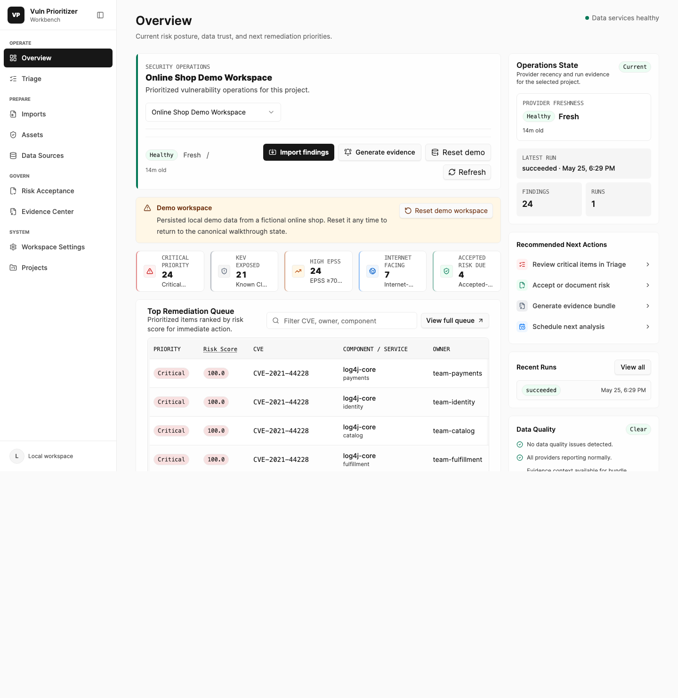

# Install And Launch

This guide covers the standard local Vuln Prioritizer Workbench runtime and the
temporary Docker Compose compatibility path.



## Requirements

- Python 3.11, 3.12, 3.13, or 3.14; Python 3.14 is recommended for new
  installations and is the pinned Docker runtime.
- `pipx` for an isolated installation. Install it through your operating
  system package manager or `python3 -m pip install --user pipx`.
- A current browser.

The standard runtime does not require Docker, PostgreSQL, Node.js, or a separate
worker service.

## Install The Workbench

Install the current source tree:

```bash
git clone https://github.com/Noetheon/vuln-prioritizer-workbench.git
cd vuln-prioritizer-workbench
pipx install ./backend
vpw serve
```

Open `http://127.0.0.1:8765` if the browser does not open automatically. Stop
the Workbench with `Ctrl-C`.

To test a specific release wheel before publishing it:

```bash
pipx install ./vuln_prioritizer_workbench-X.Y.Z-py3-none-any.whl
vpw serve
```

After the matching package-registry artifact is published and verified, the
short install becomes:

```bash
pipx install vuln-prioritizer-workbench
```

`v1.3.0` is the first release line containing `vpw serve`. Use the attached
wheel while the GitHub Release is still under draft-first review; a GitHub tag
or draft alone does not prove that the registry artifact is available.

Upgrade or remove the isolated installation with:

```bash
pipx install --force ./backend
pipx uninstall vuln-prioritizer-workbench
```

Uninstalling the package does not delete local Workbench data.

## Local Data

`vpw serve` creates these resources under the platform application-data
directory:

- `workbench.db`: SQLite database in WAL mode
- `imports/`: uploaded source files
- `reports/`: generated reports and evidence bundles
- `provider-cache/`: local provider cache

Defaults are:

| Platform | Data directory |
| --- | --- |
| macOS | `~/Library/Application Support/Vuln Prioritizer Workbench` |
| Windows | `%LOCALAPPDATA%\Vuln Prioritizer Workbench` |
| Linux | `${XDG_DATA_HOME:-~/.local/share}/vuln-prioritizer-workbench` |

Select an explicit directory when you want an isolated instance:

```bash
vpw serve --data-dir ./vpw-data
```

Each start applies Alembic migrations before serving requests. SQLite
connections enable foreign keys, a 30-second busy timeout, WAL journaling, and
normal synchronous durability. Keep the database and its `-wal`/`-shm` sidecars
together while the process is running.

## Backup And Restore

`vpw backup` writes one zip archive with a consistent copy of the database
(SQLite's online backup API, so a running Workbench keeps serving), the
uploaded files, the reports, and the provider snapshots, plus a manifest with
the SHA-256 of every file. The archive is readable only by you.

```bash
vpw backup --data-dir ./vpw-data --output ./vpw-backup.zip
vpw backup --include-cache   # also keep the provider cache
vpw restore ./vpw-backup.zip --data-dir ./vpw-restored
```

`vpw restore` only writes into a new or empty directory. It checks every file
against the manifest, refuses paths outside the data layout, refuses backups
from a newer VPW version, then migrates the database to the installed version
and runs SQLite's integrity check. The target may be a different directory or
machine: stored report paths are moved to the restored location. Stop
`vpw serve` and point it at the restored directory, or move the old directory
aside and restore into its place. The Docker Compose path keeps using
`scripts/workbench-backup.sh`.

## Settings File

`vpw serve` reads `vpw.toml` from the data directory when it exists, or the file
passed with `--config`. Command-line options and environment variables win over
the file; unknown settings are errors.

```toml
[serve]
port = 8877
open_browser = false
log_level = "info"       # debug, info, warning, error
# host = "127.0.0.1"     # non-loopback hosts still need --allow-network

[providers]
nvd_api_key = "..."      # sets the NVD key variable (default NVD_API_KEY)
github_token = "..."     # sets the GitHub token variable (default GITHUB_TOKEN)

[imports]
max_upload_mb = 50
grype_executable = "/usr/local/bin/grype"
sbom_scan_timeout_seconds = 600
```

Keep a file with secrets readable only by you (`chmod 600 vpw.toml`); `vpw serve`
warns when it is not. Backups do not include `vpw.toml`.

## Importing From The Command Line

`vpw import` uploads a file to a running Workbench, waits for the run, and
prints its counts and link. It exits non-zero when the import fails, so it fits
scheduled scans:

```bash
trivy image --format json --output scan.json registry.example/app:1.4
vpw import scan.json --project "Payments" --input-type trivy-json
vpw import scan.json --project "Payments" --input-type trivy-json \
  --create-project --keep-missing-open --json
```

`--url` (or `VPW_URL`) selects another Workbench address, `--no-wait` returns
after queueing, and `--asset-context`, `--vex`, `--provider-snapshot`, and
`--locked-provider-data` match the import wizard's options.

## Runtime Options

```bash
vpw serve --help
vpw serve --port 8877
vpw serve --no-browser
vpw serve --data-dir ./vpw-data
```

Loopback binding is the safety default. A non-loopback host requires both an
explicit host and acknowledgement:

```bash
vpw serve --host 192.0.2.10 --allow-network
```

This flag does not add authentication, TLS, RBAC, or multi-user isolation.
Place VPW only on a trusted private host and review the threat model first.

## Decision Ledger Maintenance

Normal starts and migrations backfill the materialized current projection.
Maintainers can run explicit checks against an instance:

```bash
vpw ledger backfill --data-dir ./vpw-data
vpw ledger verify --strict --data-dir ./vpw-data
```

`backfill` is idempotent. `verify --strict` returns a non-zero status when a
current projection no longer matches its immutable source, its own payload
hash, or its materialized query columns.

## Docker Compose Compatibility Path

Docker Compose/PostgreSQL is retained for one transition release for existing
operators. It is deprecated for new installations and will be eligible for
removal only after the same release candidate has passed functional and data
parity gates on both databases.

Requirements for this path are Docker Desktop or Docker Engine with the Compose
plugin. Start it from a repository checkout or source release bundle:

```bash
bash scripts/launch-workbench.sh start
```

Manual startup remains available:

```bash
cp .env.example .env
docker compose -f compose.yml -f compose.override.yml up --build backend frontend worker
```

The compatibility topology uses separate backend, frontend, worker, and
PostgreSQL services. It keeps the same API, Workflow v2, Decision Ledger,
migrations, reports, and frontend contracts as `vpw serve`.

Do not point `vpw serve` at an existing Compose data volume and do not assume a
PostgreSQL dump can be opened as SQLite. Existing operators should create a
verified backup and use `vpw migrate database` through the
[single-process runtime transition](docs/single-process-runtime-transition.md).
The conversion is explicit, refuses non-empty targets, verifies database and
artifact parity, and never silently replaces the source.

## First Run Demo

Open the Workbench and use **Load demo workspace** on the dashboard. The
packaged provider snapshot and ATT&CK resources allow this path to run without
live provider credentials.

## Troubleshooting

See [TROUBLESHOOTING.md](TROUBLESHOOTING.md) for port conflicts, database
checks, data-directory recovery, and the deprecated Compose path.
