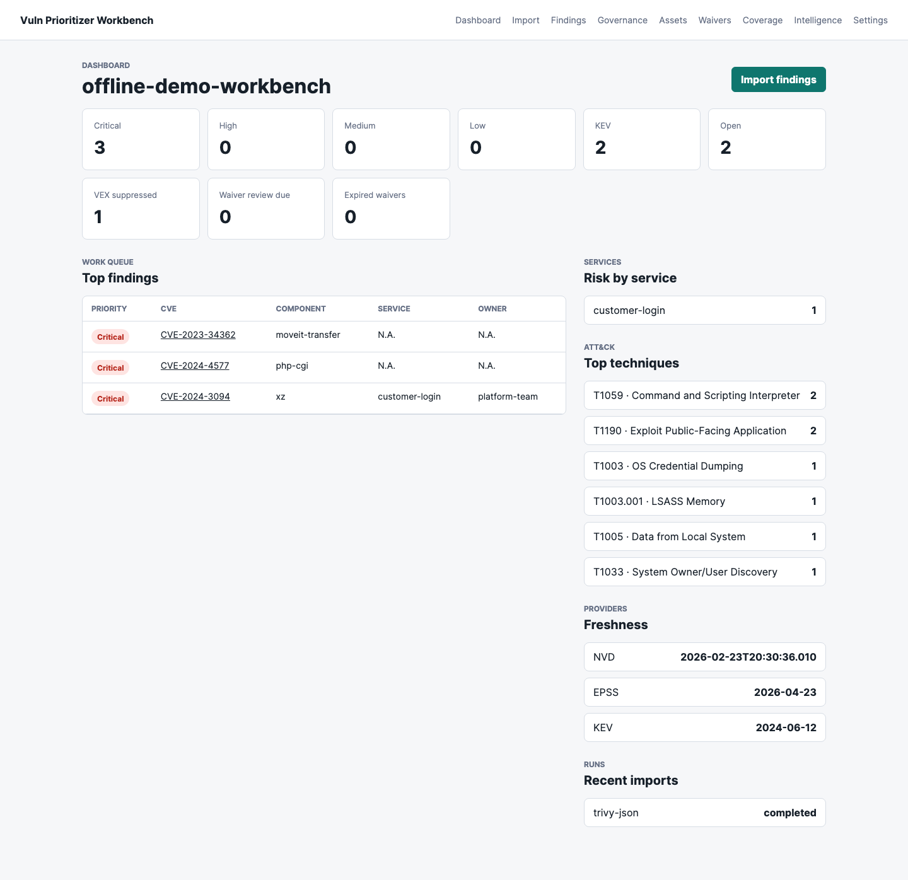
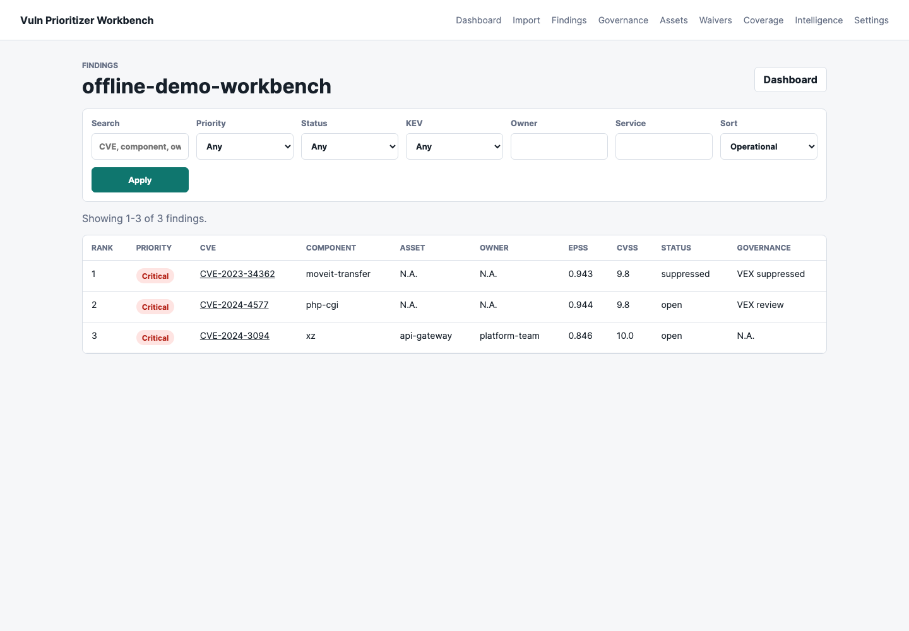
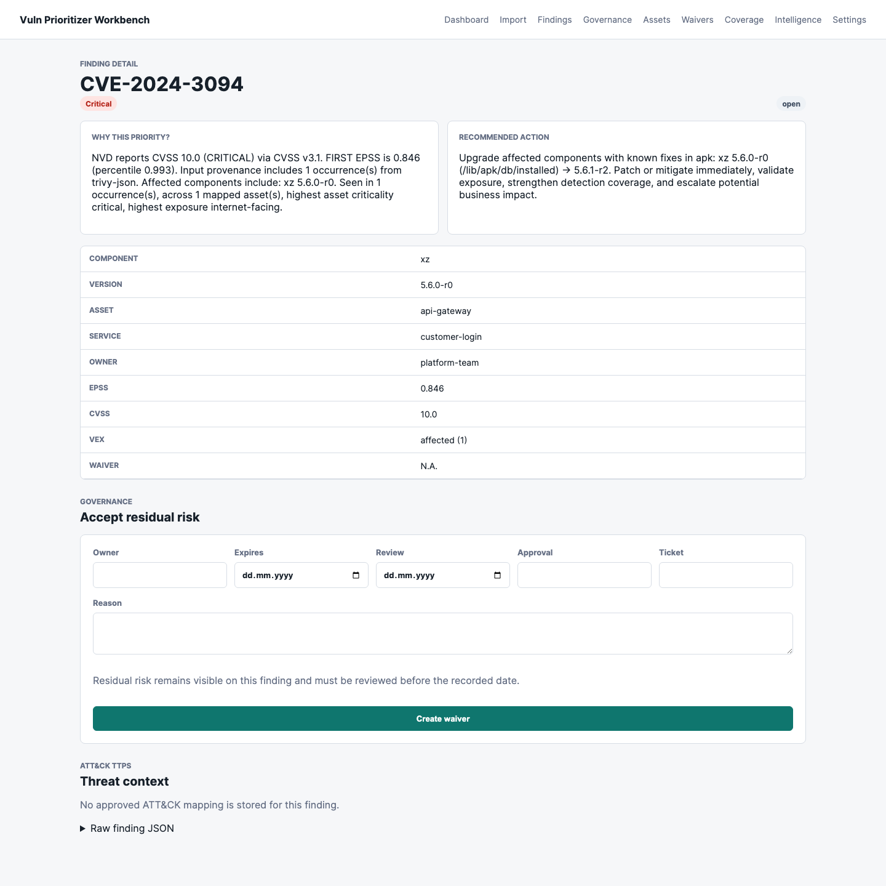
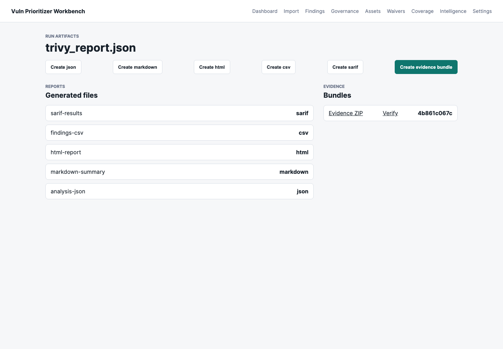

# vuln-prioritizer

[](https://www.python.org/)
[](LICENSE)
[](./CHANGELOG.md)
[](#development)

`vuln-prioritizer` is a Python CLI and self-hosted Workbench for prioritizing known CVEs. It accepts plain CVE lists plus existing scanner and SBOM exports, enriches them with `NVD + EPSS + CISA KEV`, and adds optional ATT&CK, defensive-context, asset-context, VEX, waiver, and evidence layers without turning the priority model into a black box.


Workbench demo screenshots:






README media maintenance checklist for future releases:

- Capture screenshots from the locked offline demo path in [docs/workbench-offline-demo.md](docs/workbench-offline-demo.md), not from customer data or live provider-only runs.
- Keep screenshot paths repository-relative, and keep or update README links in the same change.
- Crop to the Workbench or report UI only; do not include shell history, API keys, cookies, private home-directory paths, browser profiles, or environment variable values.
- Show secret-bearing settings only in their redacted `<set>` or `<not set>` state.
- Commit generated screenshot replacements only as part of a release evidence or docs refresh change.

## Problem And Goal

Security teams often start with a long list of CVEs from scanners, SBOM tools,
advisory exports, or issue trackers. Raw CVSS scores alone do not explain what
should be fixed first, which systems are exposed, which findings are already
covered by VEX/waivers, or which decisions need evidence.

`vuln-prioritizer` turns existing CVE evidence into an explainable
risk-to-decision workflow:

```text
existing findings or SBOM exports
  -> normalized CVE occurrences
  -> CVSS, EPSS, KEV, optional ATT&CK, asset, VEX, waiver, and provider context
  -> transparent priority and rationale
  -> reports, CI gates, evidence bundles, and Workbench decision queues
```

The goal is not to discover vulnerabilities. The goal is to help operators make
defensible decisions from vulnerability evidence they already have.

## Why Use It

- Transparent, rule-based prioritization instead of opaque scoring.
- Local-first workflows with saved JSON, HTML reports, snapshots, optional SQLite-backed history views, rollups, and evidence bundles.
- Optional ATT&CK context from local CTID/MITRE data, not heuristic CVE-to-ATT&CK guesses.
- CI-friendly outputs including Markdown summaries, SARIF, GitHub Action support, and policy gates.
- Explicit support for local defensive context, VEX, asset context, waivers, and reproducible review artifacts.
- Waiver lifecycle visibility with active, review-due, and expired states instead of silent long-lived exceptions.
- A Docker/Compose path that runs the current template-aligned Workbench shell
  while keeping the CLI core available in the same image.

## What It Can Do

Core commands:

- `analyze`: prioritize findings from CVE lists, scanner exports, or SBOM exports
- `compare`: show how enriched prioritization differs from CVSS-only
- `explain`: explain a single CVE decision in detail
- `doctor`: validate local setup, config, cache, files, and optional live source reachability
- `snapshot create|diff`: capture a run and compare before/after states
- `state init|import-snapshot|history|waivers|top-services|trends|service-history`: persist snapshots in an optional local SQLite store and inspect history, waiver debt, repeated services, or service trends
- `rollup`: aggregate saved analysis or snapshots by asset or service
- `input validate`: locally validate CVE lists, scanner/SBOM export files, asset context, and VEX before enrichment
- `input inspect` / `input normalize`: emit normalized occurrences from supported inputs without provider lookup
- `attack validate|coverage|navigator-layer`: validate and use local ATT&CK mappings
- `report html|evidence-bundle|verify-evidence-bundle`: render HTML, build reproducible ZIP evidence packages, or verify bundle integrity
- `data status|update|verify|export-provider-snapshot`: inspect cache state, maintain local provider data, and export replayable provider snapshots
- `db init`: initialize the Workbench SQLite database
- `web serve`: run the FastAPI/Jinja2 Workbench web application

Supported inputs:

- `cve-list`
- `generic-occurrence-csv`
- `trivy-json`
- `grype-json`
- `cyclonedx-json`
- `spdx-json`
- `dependency-check-json`
- `github-alerts-json`
- `nessus-xml`
- `openvas-xml`

Supported outputs vary by command. The main `analyze` command supports:

- terminal table
- `markdown`
- `json`
- `sarif`
- direct HTML sidecars via `--html-output`
- Markdown executive summaries via `--summary-output`

Other commands expose the formats that fit their contract. For example, `report html` writes HTML from saved analysis JSON, evidence bundle commands write or verify ZIP bundles, and helper commands such as `doctor`, `snapshot`, `rollup`, `state`, `attack`, and `data` expose command-specific Markdown, JSON, or table output where supported.

## Scope Boundaries

This project is:

- a CLI and local Workbench for known CVEs and existing findings
- local-first and reproducibility-oriented
- explicit about data provenance and scoring rules
- designed for vulnerability management, security triage, and evidence generation

This project is not:

- a scanner
- an exploit framework, PoC generator, or active probing tool
- a SIEM
- a ticketing system
- an autopatcher or autonomous remediation agent
- a replacement for heavier vulnerability-management platforms
- a live TAXII harvester
- a heuristic or LLM-based ATT&CK mapper

It does not perform credential testing, network scanning, exploitation,
payload generation, attack simulation, or heuristic CVE-to-ATT&CK mapping.
ATT&CK support is defensive and evidence-based: use reviewed local mappings and
technique metadata only.

## Installation

### Recommended: `pipx`

```bash
pipx install git+https://github.com/Noetheon/vuln-prioritizer-workbench.git@vX.Y.Z#subdirectory=backend
vuln-prioritizer --help
```

Replace `vX.Y.Z` with the GitHub release tag you intend to consume. This README tracks the current `main` branch, so a tagged public release can legitimately expose a smaller surface than the tip of `main`. The latest public release is currently `v1.1.0`.

The repository is PyPI-ready, but the verified public install path is currently the GitHub tag install above. That is a source-at-tag install path, not a GitHub Release asset install path. Public PyPI/TestPyPI publication is wired and documented, but explicitly gated until the repository's trusted-publisher configuration is enabled. When PyPI goes live, the release workflows verify hosted-index installation automatically after publish; until then, the GitHub tag install remains the supported public path and the release workflow also verifies the same source-at-tag install contract on tag pushes.

### Example Scope

- Works after `pipx install` alone: commands that use files you create yourself or already have in your own workspace, such as `cves.txt`, `trivy-results.json`, `analysis.json`, and `report.html`.
- Needs extra local data files: ATT&CK examples require files that you pass via `--attack-mapping-file` and `--attack-technique-metadata-file`.
- Repo checkout only: examples that reference `data/...`, `docs/...`, or `make ...`. In this repository those paths refer to checked-in fixtures, checked-in docs artifacts, or maintainer targets.

### Local Development Install

```bash
python3 -m venv .venv
source .venv/bin/activate
pip install -r backend/requirements.txt
pip install -e "backend[dev]"
```

Optional:

```bash
cp .env.example .env
```

Then set `NVD_API_KEY` in `.env` if you want authenticated NVD access.

### Docker / Compose Workbench

Run the template-aligned Workbench shell and React frontend locally:

```bash
docker compose -f compose.yml -f compose.override.yml up --build backend frontend
```

Then open `http://127.0.0.1:5173` for the React shell or call the template
backend status endpoint:

```bash
curl http://127.0.0.1:8000/api/v1/workbench/status
```

Maintainers can run the same Compose readiness path through
`make docker-demo-smoke`, which starts the backend and frontend, polls
`/api/v1/workbench/status`, and tears the stack down after the check.

The default Compose stack now follows the FastAPI Full Stack Template shape:
`db`, `backend`, and `frontend`. The backend service intentionally serves the
new template shell (`app.main:app`) and does not claim the legacy Jinja2
Workbench as migrated. To smoke-test the legacy Workbench against the optional
Postgres profile and the same Alembic migration path, run:

```bash
make docker-postgres-migration-smoke
```

That starts `db` and the profiled `workbench-postgres` service, serves the
legacy Workbench on `http://127.0.0.1:8001`, and tears down the profile volumes
after the health check.

The backend image still contains the CLI and legacy Workbench command for
profiled migration checks. You can initialize a profiled legacy database
explicitly with:

```bash
docker compose -f compose.yml -f compose.override.yml --profile postgres run --rm workbench-postgres vuln-prioritizer db init
```

The CLI remains available in the same image:

```bash
docker build -f backend/Dockerfile -t vuln-prioritizer-workbench-backend:local .
docker run --rm vuln-prioritizer-workbench-backend:local vuln-prioritizer --help
```

Equivalent local Workbench commands after a normal Python install:

```bash
export VULN_PRIORITIZER_DB_URL=sqlite:///./data/workbench.db
export VULN_PRIORITIZER_UPLOAD_DIR=./data/uploads
export VULN_PRIORITIZER_REPORT_DIR=./data/reports
export VULN_PRIORITIZER_PROVIDER_SNAPSHOT_DIR=./data
export VULN_PRIORITIZER_CACHE_DIR=./.cache/vuln-prioritizer
vuln-prioritizer db init
vuln-prioritizer web serve --host 127.0.0.1 --port 8000
```

Workbench runtime environment:

| Variable | Default / Compose value | Purpose |
| --- | --- | --- |
| `NVD_API_KEY` | empty | Optional authenticated NVD access. |
| `VULN_PRIORITIZER_NVD_API_KEY_ENV` | `NVD_API_KEY` | Name of the environment variable read for the NVD key. |
| `VULN_PRIORITIZER_DB_URL` | local: `sqlite:///./data/workbench.db`; profiled Compose migration smoke: `postgresql+psycopg://...@db:5432/workbench` | Legacy Workbench database URL. |
| `VULN_PRIORITIZER_UPLOAD_DIR` | local: `data/uploads`; Compose: `/app/uploads` | Uploaded source files. |
| `VULN_PRIORITIZER_REPORT_DIR` | local: `data/reports`; Compose: `/app/reports` | Generated reports and evidence bundles. |
| `VULN_PRIORITIZER_PROVIDER_SNAPSHOT_DIR` | local: `data`; Compose: `/app/provider-snapshots` | Trusted directory for locked provider snapshot replay and generated provider update snapshots. |
| `VULN_PRIORITIZER_CACHE_DIR` | local: `.cache/vuln-prioritizer`; Compose: `/app/.cache/vuln-prioritizer` | Provider cache used by Workbench analysis. |
| `VULN_PRIORITIZER_MAX_UPLOAD_MB` | `25` | Upload size limit per import. |
| `VULN_PRIORITIZER_CSRF_TOKEN` | random per process when unset | Optional fixed local form token for repeatable demos. |
| `VULN_PRIORITIZER_ALLOWED_HOSTS` | local: `127.0.0.1,localhost,testserver`; profiled Compose migration smoke: `127.0.0.1,localhost` | Comma-separated Host header allowlist for the local Workbench. |

For locked Workbench replay, submit only the snapshot filename, for example
`demo_provider_snapshot.json`. The app resolves it from
`VULN_PRIORITIZER_PROVIDER_SNAPSHOT_DIR` or the provider cache and rejects arbitrary paths.

Legacy Workbench API token behavior is intentionally local-first. A fresh local database has no active
tokens, so mutating `/api/*` requests remain open for the offline demo. Create the first token with
`POST /api/tokens`; after any active token exists, `POST`, `PUT`, `PATCH`, and `DELETE` requests under
`/api/` require `Authorization: Bearer <token>` or `X-API-Token: <token>`. Only SHA-256 token hashes
are stored.

The template-aligned Workbench shell currently has a configured-superuser JWT
login smoke path. DB-backed template users, RBAC, and final project membership
rules are separate migration work.

Workbench project settings can be saved as config-as-code through
`POST /api/projects/{project_id}/settings/config`. The payload uses the same
`vuln-prioritizer.yml` schema as the CLI runtime config, rejects unknown keys, and keeps backward
defaults when no project snapshot exists.

Provider update jobs are available at `POST /api/providers/update-jobs` and from the Settings page.
They are synchronous local jobs intended for cron or other trusted local schedulers; failures are
recorded without replacing the previous provider snapshot. GitHub issue export starts with
`POST /api/projects/{project_id}/github/issues/preview` and can create issues through
`POST /api/projects/{project_id}/github/issues/export` when `dry_run` is false, a repository is
provided, and the selected token environment variable is configured.

Current local Workbench limitations:

- The Compose path is local-first and single-node. It is not hardened for internet exposure.
- The Workbench UI/API supports the same input-format matrix as the CLI for local single-file and multi-file imports.
- SQLite remains the default Workbench runtime; the Compose Postgres profile is an optional migration smoke path. The Workbench records durable job state for local imports, provider refreshes, reports, and evidence bundles, but a separate async worker process, SSO, organization-wide ticket sync policy, and multi-workspace tenancy remain outside the current local-first scope.
- The project still does not scan systems, patch software, or generate heuristic/AI CVE-to-ATT&CK mappings.
- Do not expose the local Workbench on the public internet without a separate hardening review covering TLS/proxying, backup/restore, audit retention, role design, token handling, and the threat model.

Current Workbench readiness and shared-deployment prerequisites are tracked in [docs/workbench-threat-model.md](docs/workbench-threat-model.md). The historical implementation plan remains available in [docs/workbench-masterplan.md](docs/workbench-masterplan.md), and [docs/roadmap.md](docs/roadmap.md) tracks the shipped CLI plus local Workbench release line.

## Demo

For a local browser demo, use the checked-in offline runbook:
[docs/workbench-offline-demo.md](docs/workbench-offline-demo.md). It uses
repository fixtures and locked provider replay so screenshots and evidence can
be reproduced without customer data or live-only provider behavior.

For a template-migration smoke demo, run:

```bash
make docker-demo-smoke
```

That command starts the template backend and React shell, verifies
`/api/v1/workbench/status`, checks the frontend and login route, then tears down
the stack.

## Quickstart

### 1. Fastest Public-Install Analyze Run

```bash
printf 'CVE-2021-44228\nCVE-2024-3094\n' > cves.txt
vuln-prioritizer analyze --input cves.txt --format markdown --output report.md
```

### 2. Public-Install Analyze from Your Own Existing Scan Export

```bash
vuln-prioritizer analyze \
  --input trivy-results.json \
  --input-format trivy-json \
  --format json \
  --output analysis.json \
  --summary-output summary.md \
  --html-output report.html
```

### 3. Public-Install Snapshot Diff and Service Rollup

```bash
vuln-prioritizer snapshot create \
  --input trivy-results.json \
  --input-format trivy-json \
  --output after.json

vuln-prioritizer snapshot diff \
  --before before.json \
  --after after.json \
  --format markdown

vuln-prioritizer rollup \
  --input after.json \
  --by service \
  --format markdown
```

### 4. Public-Install Evidence Bundle Integrity Verification

```bash
vuln-prioritizer report evidence-bundle \
  --input analysis.json \
  --output evidence.zip

vuln-prioritizer report verify-evidence-bundle \
  --input evidence.zip \
  --format json \
  --output evidence-verification.json
```

### 5. ATT&CK-Aware Analyze with Your Own Local Mapping Files

ATT&CK/TTP context in this project is defensive context for risk explanation,
detection coverage, mitigation discussion, and prioritization. It is not
exploit proof, attack-chain guidance, or evidence that a CVE is actively being
used against your environment.

```bash
vuln-prioritizer analyze \
  --input cves.txt \
  --format markdown \
  --output attack-report.md \
  --attack-source ctid-json \
  --attack-mapping-file ./attack-mapping.json \
  --attack-technique-metadata-file ./attack-techniques.json
```

Those ATT&CK files are not bundled by a `pipx` install. If you are working from a repository checkout, the checked-in demo inputs live under `data/attack/`.

### 6. Optional Local Defensive Context Overlay

```bash
vuln-prioritizer analyze \
  --input trivy-results.json \
  --input-format trivy-json \
  --defensive-context-file ./defensive-context.json \
  --format json \
  --output analysis.json
```

`--defensive-context-file` is a local/offline JSON overlay for OSV, GHSA, Vulnrichment, or SSVC evidence you already have. It is not a live advisory fetch path, and it does not affect the base priority scoring from CVSS, EPSS, and KEV.

### 7. Optional Local SQLite State Store

```bash
vuln-prioritizer state init --db build/state.db

vuln-prioritizer state import-snapshot \
  --db build/state.db \
  --input after.json

vuln-prioritizer state top-services \
  --db build/state.db \
  --days 30 \
  --format json \
  --output state-top-services.json

vuln-prioritizer state trends --db build/state.db --format json
vuln-prioritizer state service-history --db build/state.db --service payments
```

### 8. Reproducible Provider Snapshot Replay

```bash
vuln-prioritizer data export-provider-snapshot \
  --input cves.txt \
  --output provider-snapshot.json

vuln-prioritizer analyze \
  --input cves.txt \
  --provider-snapshot-file provider-snapshot.json \
  --locked-provider-data \
  --format json \
  --output analysis.json
```

Use `--cache-only` on `data export-provider-snapshot` when local smoke tests must avoid live provider refreshes.

### 9. Maintainer Demo Evidence Bundle

From a repository checkout, maintainers can reproduce the Workbench v1.0 demo evidence bundle without live provider calls:

```bash
make demo-evidence-bundle-check
```

The target uses checked-in fixtures, `data/demo_provider_snapshot.json`, locked provider replay, and the fixed demo timestamp configured in the `Makefile`. It writes:

- `build/v1.0-demo-analysis.json`
- `build/v1.0-demo-evidence-bundle.zip`
- `build/v1.0-demo-evidence-bundle-verification.json`

To verify an already generated bundle from the checkout, run the same CLI contract directly:

```bash
PYTHONPATH=backend/src VULN_PRIORITIZER_FIXED_NOW=2026-04-21T12:00:00+00:00 \
  python3 -m vuln_prioritizer.cli report verify-evidence-bundle \
  --input build/v1.0-demo-evidence-bundle.zip \
  --output build/v1.0-demo-evidence-bundle-verification.json \
  --format json
```

Record release evidence with repository-relative paths only. Archive the command output, `git rev-parse HEAD`, the verification JSON where `summary.ok` is `true`, and SHA-256 values for the three generated files:

```bash
shasum -a 256 \
  build/v1.0-demo-analysis.json \
  build/v1.0-demo-evidence-bundle.zip \
  build/v1.0-demo-evidence-bundle-verification.json
```

Do not record machine-specific absolute paths, `.env` contents, API keys, tokens, cookies, or private scan exports in public release evidence.

## Runtime Config

`v1.1.0` adds first-class runtime config via `vuln-prioritizer.yml`.

The optional SQLite state store is intentionally separate: it is local-only, opt-in, and does not change `analyze`, `report`, `snapshot`, or evidence semantics.

Example:

```yaml
defaults:
  policy_profile: enterprise
  # Add ATT&CK defaults only if you keep local mapping files yourself.
  # attack_source: ctid-json
  # attack_mapping_file: ./attack-mapping.json
  # attack_technique_metadata_file: ./attack-techniques.json

commands:
  analyze:
    format: json
  attack:
    validate:
      attack_mapping_file: ./attack-mapping.json
      attack_technique_metadata_file: ./attack-techniques.json
  data:
    export-provider-snapshot:
      cache_only: true
```

Use it with auto-discovery or explicitly:

```bash
vuln-prioritizer analyze --input cves.txt
vuln-prioritizer --config vuln-prioritizer.yml analyze --input trivy-results.json --input-format trivy-json
vuln-prioritizer --no-config analyze --input cves.txt
```

## Public Docs

Start here for public CLI usage and the local Workbench app path:

- [docs/use_cases.md](docs/use_cases.md)
- [docs/playbooks.md](docs/playbooks.md)
- [docs/support_matrix.md](docs/support_matrix.md)
- [docs/benchmarking.md](docs/benchmarking.md)
- [docs/contracts.md](docs/contracts.md)
- [docs/methodology.md](docs/methodology.md)
- [docs/evidence.md](docs/evidence.md)
- [docs/integrations/reporting_and_ci.md](docs/integrations/reporting_and_ci.md)
- [docs/releases/v1.1.0.md](docs/releases/v1.1.0.md)
- [docs/roadmap.md](docs/roadmap.md)
- [ROADMAP.md](ROADMAP.md)
- Historical Workbench masterplan: [docs/workbench-masterplan.md](docs/workbench-masterplan.md)

Maintainer / repo-checkout workflows:

- [docs/release_operations.md](docs/release_operations.md)

## Community And Support

- Usage questions and workflow help: GitHub Discussions
- Reproducible bugs and scoped feature requests: GitHub Issues
- Security reports: GitHub private vulnerability reporting, with [SECURITY.md](SECURITY.md) as the fallback route
- Contribution rules and local validation: [CONTRIBUTING.md](CONTRIBUTING.md)
- Support routing: [SUPPORT.md](SUPPORT.md)

Reference material:

- [docs/roadmap.md](docs/roadmap.md)
- [docs/reference_cve_prioritizer_gap_analysis.md](docs/reference_cve_prioritizer_gap_analysis.md)

## GitHub Action

The repository includes a composite GitHub Action for `analyze`, `compare`, `explain`, `doctor`, input validation, snapshots, rollups, provider-data verification, ATT&CK validation/coverage, static report rendering, Workbench-style report artifacts, evidence bundles, and SARIF validation.

Use it after `actions/checkout`, because scan exports, SBOMs, or other analysis input files live in the consumer repository, not in the action repository.
In `mode: analyze`, `input` and `input-format` accept newline-delimited values so one action step can merge multiple sources. The action also passes through the CLI's waiver, filter, sort, cache, provider replay, and fail-gate flags for deterministic CI runs.

```yaml
- uses: actions/checkout@v6

- name: Prioritize vulnerabilities
  uses: Noetheon/vuln-prioritizer-workbench@vX.Y.Z
  with:
    mode: analyze
    input: |
      trivy-results.json
      github-alerts-export.json
    input-format: |
      trivy-json
      github-alerts-json
    output-format: json
    output-path: analysis.json
    summary-output-path: summary.md
    summary-template: compact
    html-output-path: report.html
    github-step-summary: "true"
    defensive-context-file: defensive-context.json
    waiver-file: waivers.yml
    hide-waived: "true"
    fail-on: critical
    fail-on-expired-waivers: "true"
    max-provider-age-hours: "48"
    fail-on-stale-provider-data: "true"
    sort-by: operational
    max-cves: "250"
```

Replace `vX.Y.Z` with the release tag or commit SHA you want to consume. `summary-template` is backward-compatible and defaults to `detailed`. Set it to `compact` for GitHub step summaries or PR comments, or keep `detailed` when you want the full executive summary artifact. If a workflow only needs `$GITHUB_STEP_SUMMARY`, the action can now generate a summary without requiring an explicit `summary-output-path`.

Common analyze/compare/snapshot Action inputs include `waiver-file`, `defensive-context-file`, `hide-waived`, `fail-on-provider-error`, `fail-on-expired-waivers`, `fail-on-review-due-waivers`, `priority`, `kev-only`, `min-cvss`, `min-epss`, `sort-by`, `max-cves`, `provider-snapshot-file`, `locked-provider-data`, `max-provider-age-hours`, `fail-on-stale-provider-data`, `no-cache`, `cache-dir`, `cache-ttl-hours`, `nvd-api-key-env`, `offline-kev-file`, and `offline-attack-file`. `defensive-context-file` passes a local/offline JSON context overlay only; it does not fetch advisory data and does not change base priority scoring. Report modes include `report-html`, `workbench-report`, `report-evidence-bundle`, `verify-evidence-bundle`, and `validate-sarif`; set `validate-sarif: "true"` in analysis/report steps when a SARIF output should fail the job before upload if the local SARIF contract is not met.

See [docs/integrations/reporting_and_ci.md](docs/integrations/reporting_and_ci.md) for the full contract and CI patterns, plus [docs/examples/github_action_summary_templates.md](docs/examples/github_action_summary_templates.md) for compact vs detailed examples.

## Development

Useful local gates:

```bash
python3 -m pytest -q
make check
make benchmark-check
make playwright-install
make playwright-check
make release-check
make demo-sync-check-temp
make package-check-temp
```

Use `make playwright-check` for real-browser Workbench coverage; run `make playwright-install` once on a development machine before the first Playwright run. If you change docs, examples, or report artifacts, run `make release-check` so the committed example outputs stay in sync. Use the `*-temp` targets when you want the same demo or package validation in a temporary copy without mutating checked-in docs artifacts or `dist/`.

Pull request readiness:

- State whether the change affects CLI, Workbench, Docker, docs, release, or packaging behavior.
- Include the local checks you ran. For docs-only changes, `make docs-check` plus targeted CLI help checks is usually enough; broader behavior changes should use `make check` or `make release-check`.
- Keep public examples aligned with the supported install path, the local Workbench limitations above, and the no-scanner/no-heuristic-ATT&CK scope boundary.

## Project Status

Current release line:

- current package line `v1.1.0`
- Workbench local app, advanced ATT&CK, governance, reporting, and integration surfaces implemented on `main`
- GitHub tag install path is available for `v1.1.0`
- GitHub Release is published for `v1.1.0` with source and wheel distribution assets
- PyPI and TestPyPI workflows prepared, but live publishing remains explicitly gated until trusted-publisher setup is enabled

## License

[MIT](LICENSE)
