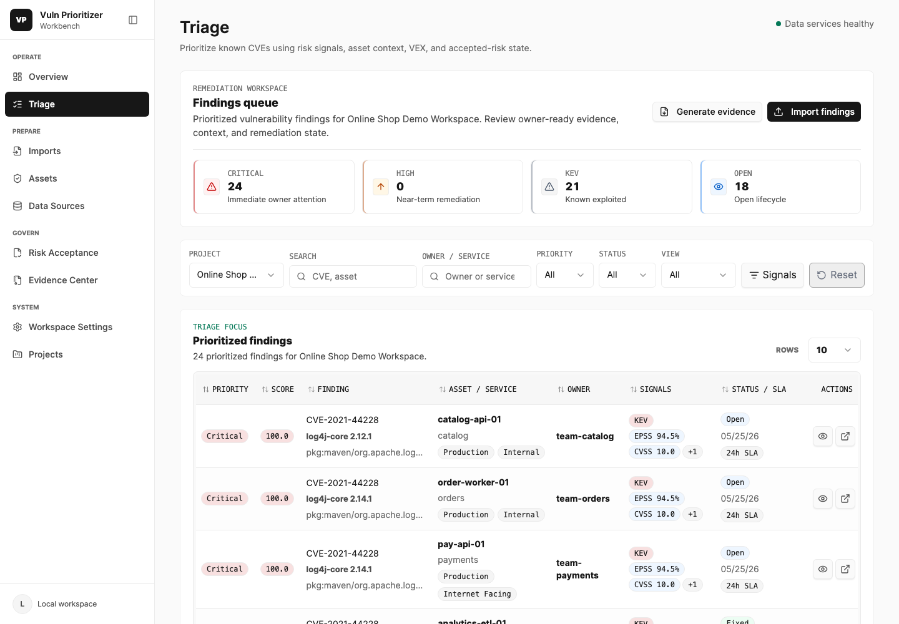
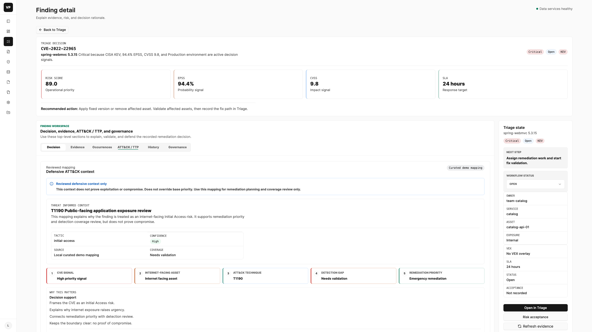
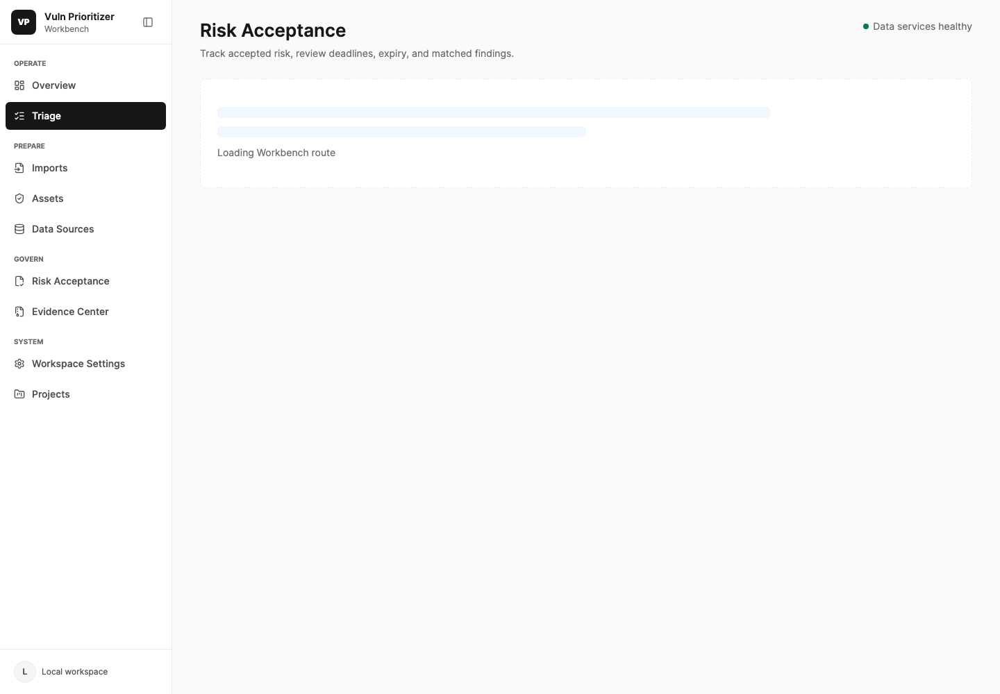
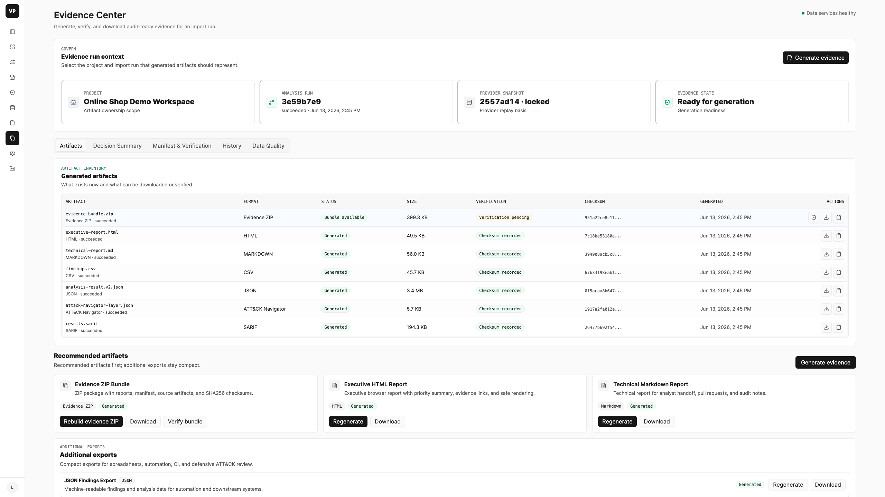

# Vuln Prioritizer Workbench

[](https://www.python.org/)
[](LICENSE)
[](#status-and-scope)
[](#quickstart)

Vuln Prioritizer Workbench is a local-first, single-user Workbench for
prioritizing already-known CVEs from supplied evidence. It imports CVE lists,
scanner exports, SBOM vulnerability exports, VEX statements, and asset context,
then explains priority with transparent signals such as CVSS, EPSS, CISA KEV,
provider freshness, reviewed ATT&CK/TTP context, lifecycle state, waivers, and
evidence artifacts.


## What It Does

- Imports existing vulnerability evidence; it does not scan networks or hosts.
- Normalizes findings into a local Workbench project with asset, component,
  owner, service, exposure, and source provenance where the input format
  provides it.
- Prioritizes findings with explainable CVSS, EPSS, KEV, asset context,
  lifecycle, waiver, and curated defensive ATT&CK/TTP signals.
- Generates audit-ready local artifacts: Markdown, HTML, JSON, CSV, SARIF,
  ATT&CK Navigator, and Evidence ZIP outputs.
- Keeps demo and provider snapshot workflows reproducible for local review,
  screenshots, and release evidence.

## Quickstart

The supported end-user path is the local launcher. It prepares `.env` when
needed, generates local-only secrets, builds Docker images, starts PostgreSQL,
the FastAPI backend, the workflow worker, and the React frontend, then prints
the URL.

```bash
bash scripts/launch-workbench.sh start
```

macOS:

```bash
./launch-workbench.command
```

Windows:

```powershell
powershell -ExecutionPolicy Bypass -File scripts\launch-workbench.ps1 start
```

Open the printed frontend URL and load the demo workspace from the dashboard.
For a deterministic presentation-ready demo, run:

```bash
bash scripts/launch-workbench.sh demo
```

Useful launcher commands:

```bash
bash scripts/launch-workbench.sh status
bash scripts/launch-workbench.sh logs
bash scripts/launch-workbench.sh smoke
bash scripts/launch-workbench.sh update
bash scripts/launch-workbench.sh diagnostics
bash scripts/launch-workbench.sh stop
```

Manual Docker Compose startup remains supported:

```bash
cp .env.example .env
docker compose -f compose.yml -f compose.override.yml up --build backend frontend worker
```

Detailed install paths for Git clones, GitHub Release ZIPs, macOS, Linux, and
Windows are in [INSTALL.md](INSTALL.md). Recovery steps for Docker, ports,
permissions, reset, update, and diagnostics are in
[TROUBLESHOOTING.md](TROUBLESHOOTING.md).

## Product Tour

| Triage queue | Finding evidence |
| --- | --- |
|  |  |

| Risk acceptance | Evidence Center |
| --- | --- |
|  |  |

The checked-in public screenshots are 2560x1440 light-theme captures from the
current local Workbench demo path with the sidebar collapsed. Refresh them when
demo data or primary navigation changes. The broader Playwright evidence set
remains test or archive evidence, not public README media.

## Supported Inputs

Workbench imports require an explicit `input_type`. Current public detail pages
cover every active import format:

| Format | Detail |
| --- | --- |
| CVE list | [CVE List Import](docs/cve-list-import.md) |
| Generic occurrence CSV | [Generic Occurrence CSV Import](docs/generic-occurrence-csv-import.md) |
| Trivy JSON | [Trivy JSON Import](docs/trivy-json-import.md) |
| Grype JSON | [Grype JSON Import](docs/grype-json-import.md) |
| CycloneDX JSON | [CycloneDX JSON Import](docs/cyclonedx-json-import.md) |
| SPDX JSON | [SPDX JSON Import](docs/spdx-json-import.md) |
| Dependency-Check JSON | [Dependency-Check JSON Import](docs/dependency-check-json-import.md) |
| GitHub alerts JSON | [GitHub Alerts JSON Import](docs/github-alerts-json-import.md) |
| Nessus XML | [Nessus XML Import](docs/nessus-xml-import.md) |
| OpenVAS XML | [OpenVAS XML Import](docs/openvas-xml-import.md) |

See the [Support Matrix](docs/support_matrix.md) for normalized provenance,
context overlays, report formats, and operational notes.

## Outputs And Evidence

Report jobs run through the durable workflow worker and write local artifacts
for the selected analysis run:

- technical Markdown report
- executive HTML report
- stable `analysis-result.v2.json`
- findings CSV
- SARIF 2.1.0
- ATT&CK Navigator layer
- deterministic Evidence ZIP with manifest and verification metadata

Canonical VPW-054 demo report snapshots:

- [Technical Markdown report](docs/examples/vpw-054-workbench-technical-report.md)
- [Executive HTML report](docs/examples/vpw-054-workbench-executive-report.html)
- [Stable analysis result JSON](docs/examples/vpw-054-workbench-analysis-result.v2.json)

Start with [Reports and Evidence](docs/reports-and-evidence.md),
[Contracts](docs/contracts.md), and the
[Decision/Evidence Kernel](docs/architecture/decision-evidence-kernel.md) for
the evidence model and artifact contracts. Public examples live under
[`docs/examples/`](docs/examples/) and small contract fixtures under
[`docs/evidence/`](docs/evidence/).

## Status And Scope

The current package metadata is `Development Status :: 4 - Beta`: local-first
self-hosted Workbench readiness, without public/shared deployment
certification.

VPW is defensive prioritization software. It is not a vulnerability scanner,
exploit framework, PoC generator, active probing tool, credential tester,
autopatcher, hosted SaaS product, ML/AI black-box scoring system, or automatic
ATT&CK inference engine. Curated ATT&CK/TTP mappings are defensive context only
and are not proof of compromise.

## Architecture

The active runtime is:

- FastAPI backend under [`backend/app`](backend/app)
- durable worker under [`backend/app/workers`](backend/app/workers)
- React/Vite/TypeScript Workbench under [`frontend`](frontend)
- generated OpenAPI client under [`frontend/src/client`](frontend/src/client)
- domain engine under [`backend/app/domain/engine`](backend/app/domain/engine)
- MkDocs site under [`docs`](docs) and [`mkdocs.yml`](mkdocs.yml)

See [Product Architecture](docs/architecture.md),
[Current Product State](docs/current-product-state.md), and the
[Documentation Map](docs/documentation-map.md) for the fuller system map and
source-of-truth order.

## Development Checks

Use targeted checks while iterating and broader gates before handoff:

```bash
python3 -m pytest -q backend/tests/test_docs_hygiene.py --no-cov
make docs-check
make frontend-check
make check
```

For frontend screenshot evidence:

```bash
make demo-screenshot
```

## Documentation

- [Install and launch](INSTALL.md)
- [Troubleshooting](TROUBLESHOOTING.md)
- [Documentation home](docs/index.md)
- [User Documentation Guide](docs/user_documentation.md)
- [Current product state](docs/current-product-state.md)
- [Documentation map](docs/documentation-map.md)
- [Documentation evidence matrix](docs/documentation-evidence-matrix.md)
- [Product Architecture](docs/architecture.md)
- [Support Matrix](docs/support_matrix.md)
- [Reports and Evidence](docs/reports-and-evidence.md)
- [Demo Readiness](docs/demo-readiness.md)
- [Local/Private Workbench Deployment](docs/workbench-public-deployment.md)
- [GitHub Open Source Readiness](docs/github-open-source-readiness.md)
- [Contributing](CONTRIBUTING.md)
- [Security policy](SECURITY.md)
- [Code of conduct](CODE_OF_CONDUCT.md)
- [Support policy](SUPPORT.md)
- [Maintainers](MAINTAINERS.md)
- [Changelog](CHANGELOG.md)

## License

MIT. See [LICENSE](LICENSE).
