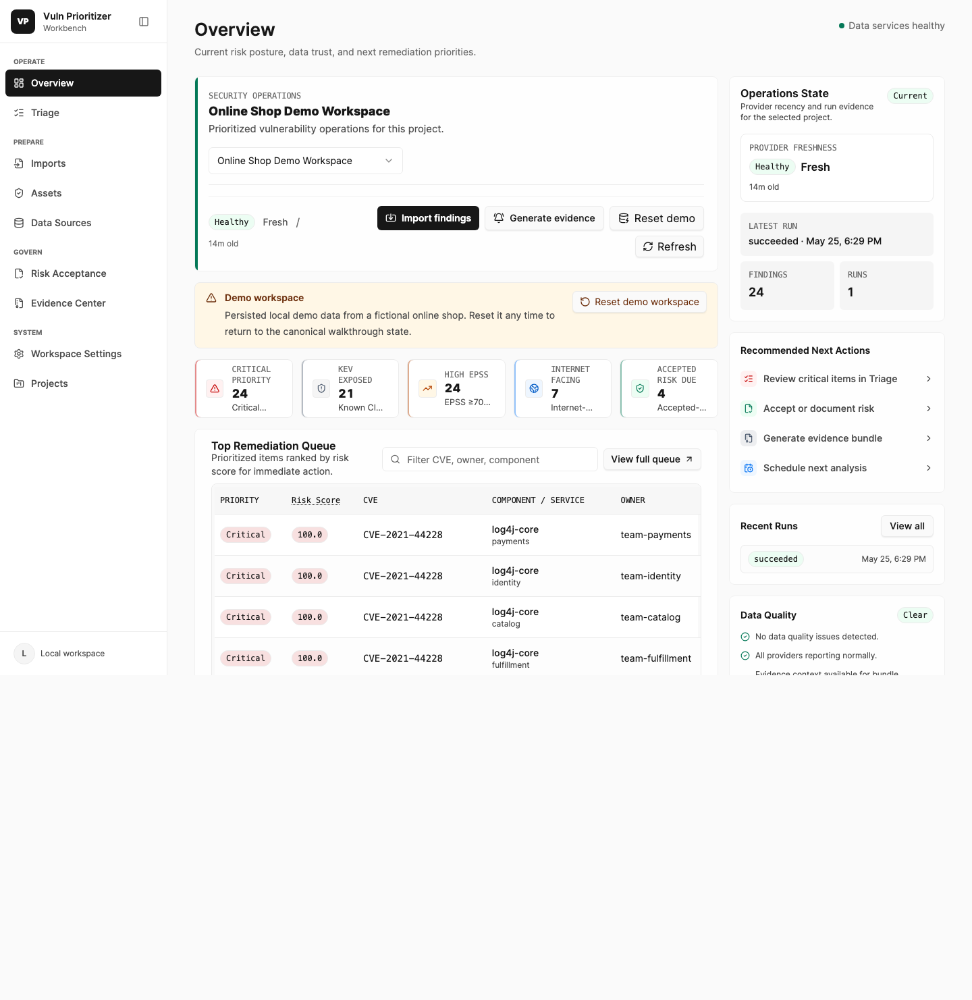

# Vuln Prioritizer Workbench

[](https://www.python.org/)
[](LICENSE)
[](#scope-and-safety)

Vuln Prioritizer Workbench is a local-first, single-user Workbench for
prioritizing known CVEs from existing evidence. It accepts CVE lists, scanner
exports, SBOM outputs, VEX statements, and asset context, then explains priority
with transparent signals such as CVSS, EPSS, CISA KEV, provider freshness,
asset context, waivers, and reviewed defensive ATT&CK/TTP mappings.



## Quickstart

The supported end-user path is the local launcher. It prepares `.env` when
needed, generates local-only secrets, builds Docker images, starts PostgreSQL,
the FastAPI backend, the workflow worker, and the React frontend, then prints
the URL.

```bash
bash scripts/launch-workbench.sh start
```

macOS:

```bash
./launch-workbench.command
```

Windows:

```powershell
powershell -ExecutionPolicy Bypass -File scripts\launch-workbench.ps1 start
```

Useful commands:

```bash
bash scripts/launch-workbench.sh status
bash scripts/launch-workbench.sh logs
bash scripts/launch-workbench.sh smoke
bash scripts/launch-workbench.sh update
bash scripts/launch-workbench.sh diagnostics
bash scripts/launch-workbench.sh stop
```

Manual Docker Compose startup remains supported:

```bash
cp .env.example .env
docker compose -f compose.yml -f compose.override.yml up --build backend frontend worker
```

Detailed install paths for Git clones, GitHub Release ZIPs, macOS, Linux, and
Windows are in [INSTALL.md](INSTALL.md). Recovery steps for Docker, ports,
permissions, reset, update, and diagnostics are in
[TROUBLESHOOTING.md](TROUBLESHOOTING.md).

## First Run

Open the printed frontend URL and use the dashboard action to load the demo
workspace. The local Docker launcher enables the demo workspace and provider
snapshot replay by default.

Maintainers can refresh reproducible demo screenshot evidence with:

```bash
make demo-screenshot
```

## Scope And Safety

VPW is defensive prioritization software. It is not a vulnerability scanner,
exploit framework, PoC generator, active probing tool, credential tester,
autopatcher, hosted SaaS product, ML/AI black-box scoring system, or automatic
ATT&CK inference engine.

Curated ATT&CK/TTP mappings are defensive context only. A mapped technique helps
with triage and detection review; it is not proof that a local environment was
compromised. Unmapped CVEs remain unmapped.

The current package metadata is `Development Status :: 4 - Beta`: local-first
self-hosted Workbench readiness, without public-production certification.

## Architecture

`backend/app` is the active browser Workbench runtime. The active backend is
FastAPI under `/api/v1`, the frontend is React/Vite/TypeScript, and the
generated API client lives under `frontend/src/client/**`. The workflow worker
is required for imports, provider refreshes, reports, retries, and cancellation.

See [Product Architecture](docs/architecture.md) and
[Current Product State](docs/current-product-state.md) for the fuller system
map.

## Documentation

- [Install and launch](INSTALL.md)
- [Troubleshooting](TROUBLESHOOTING.md)
- [Documentation home](docs/index.md)
- [User Documentation Guide](docs/user_documentation.md)
- [Current product state](docs/current-product-state.md)
- [Documentation map](docs/documentation-map.md)
- [Documentation evidence matrix](docs/documentation-evidence-matrix.md)
- [GitHub Open Source Readiness](docs/github-open-source-readiness.md)
- [Product Architecture](docs/architecture.md)
- [Decision/Evidence Kernel](docs/architecture/decision-evidence-kernel.md)
- [Dependency and Package Policy](docs/dependency-and-package-policy.md)
- [Scoring Methodology](docs/scoring-methodology.md)
- [ATT&CK/TTP Methodology](docs/attack-ttp-methodology.md)
- [Reports and Evidence](docs/reports-and-evidence.md)
- [Demo Readiness](docs/demo-readiness.md)
- [Contracts](docs/contracts.md)
- [Support Matrix](docs/support_matrix.md)
- [Workbench Threat Model](docs/workbench-threat-model.md)
- [Local/Private Workbench Deployment](docs/workbench-public-deployment.md)
- [Roadmap](docs/roadmap.md)
- [Community Repository Setup](docs/community_repository_setup.md)
- [CONTRIBUTING.md](CONTRIBUTING.md)
- [SECURITY.md](SECURITY.md)
- [CODE_OF_CONDUCT.md](CODE_OF_CONDUCT.md)
- [SUPPORT.md](SUPPORT.md)
- [MAINTAINERS.md](MAINTAINERS.md)
- [CHANGELOG.md](CHANGELOG.md)

## Demo Artifacts

Canonical report and evidence examples remain linked, not duplicated:

- [Example Markdown report](docs/example_report.md)
- [Example ATT&CK-aware report](docs/example_attack_report.md)
- [Example PR comment body](docs/examples/example_pr_comment.md)
- [VPW-054 technical report snapshot](docs/examples/vpw-054-workbench-technical-report.md)
- [VPW-054 executive report snapshot](docs/examples/vpw-054-workbench-executive-report.html)
- [VPW-054 analysis result snapshot](docs/examples/vpw-054-workbench-analysis-result.v2.json)
- [VPW-054 CSV snapshot](docs/examples/vpw-054-workbench-findings.csv)
- [VPW-054 SARIF snapshot](docs/examples/vpw-054-workbench.sarif)
- [VPW-054 evidence bundle manifest](docs/examples/vpw-054-workbench-evidence-manifest.json)
- [Final demo flow summary](archive/vpw-evidence/final-demo-flow/demo-flow-summary.md)
- [Historical evidence archive](archive/vpw-evidence/MANIFEST.md)

## License

MIT. See [LICENSE](LICENSE).
