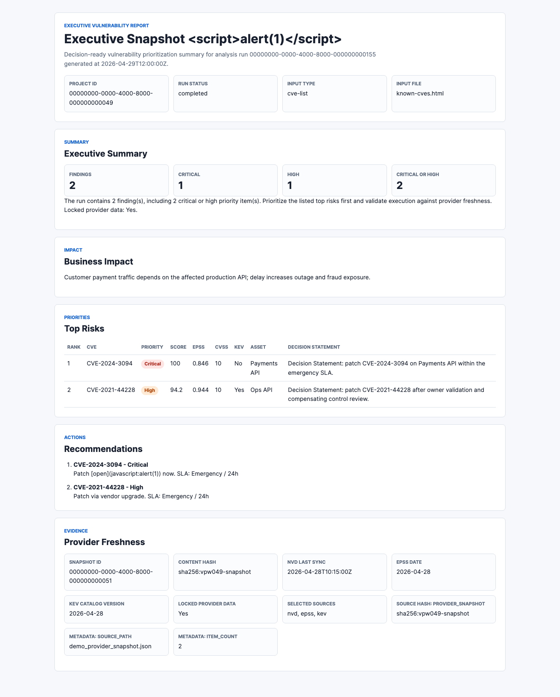

# VPW-049 HTML Executive Report Evidence

VPW-049 adds the template-stack HTML executive report path for completed
analysis runs. The implementation is additive to the VPW-048 Markdown report
path and uses the same FastAPI project visibility, run status, artifact root,
SHA-256, and download checks.

## Implemented Scope

- `ReportCreate.format` now accepts `markdown` and `html`.
- `POST /api/v1/runs/{run_id}/reports` dispatches `html` requests to the
  template report service and persists an `executive-html` report artifact.
- `GET /api/v1/reports/{report_id}/download` serves HTML reports as
  attachments with `Cache-Control: no-store`, `X-Content-Type-Options: nosniff`,
  path-root validation, and SHA-256 verification.
- The HTML report includes Executive Summary, Business Impact, Top Risks,
  Recommendations, Provider Freshness, and Decision Statement content.
- Dynamic project, asset, component, rationale, recommendation, decision, and
  provider fields are escaped before rendering.
- The HTML CSS includes responsive layout rules and print-friendly media rules.

## Evidence Artifacts

The deterministic snapshot fixture is:

```text
backend/tests/api/snapshots/vpw_049_executive_report.html
```

The screenshot evidence is:

```text
docs/evidence/vpw-049-html-executive-report.png
```



## API Response Excerpt

The API test asserts this metadata for a created HTML report:

```json
{
  "format": "html",
  "kind": "executive-html",
  "filename": "executive-report.html",
  "content_type": "text/html; charset=utf-8",
  "metadata_json": {
    "finding_count": 2,
    "format": "html",
    "kind": "executive-html"
  }
}
```

The download test verifies the artifact body hash matches the returned
`sha256`, the response is an attachment, and the response uses `no-store` plus
`nosniff` headers.

## Escaping Test Excerpt

The API fixture includes malicious project, asset, rationale, and action values
with `<script>`, ``, and `javascript:` text. The HTML download test
asserts:

```python
assert "<script" not in body.lower()
assert "<img" not in body.lower()
assert 'href="javascript:' not in body.lower()
assert "&lt;script&gt;alert(1)&lt;/script&gt;" in body
assert "&lt;img src=x onerror=alert(1)&gt;" in body
```

## Local Verification

```bash
python3 -m pytest -q backend/tests/api/test_template_reports_api.py --no-cov
python3 -m pytest -q backend/tests/api/test_template_reports_api.py backend/tests/api/test_template_workbench_api_skeleton.py backend/tests/api/test_template_model_metadata.py --no-cov
python3 -m ruff format --check backend/app backend/tests/api/test_template_reports_api.py
python3 -m ruff check backend/app backend/tests/api/test_template_reports_api.py
python3 -m mkdocs build --clean
make check
make frontend-check
npm --prefix frontend run test
git diff --check
```

Result: all commands passed locally during VPW-049 implementation. `make check`
reported 741 passed, 5 skipped, and total coverage of 90.59%. The frontend
Playwright smoke reported 1 passed.

## Residual Risk

The template report service renders current persisted finding fields for the
run-scoped finding IDs. This is acceptable for VPW-049, but immutable historical
finding snapshots would require a later run-level snapshot model.
