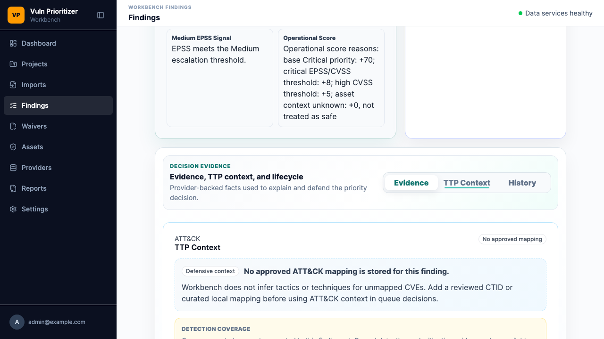

# VPW-058 TTP Context Tab Evidence

## Scope

VPW-058 adds a finding-detail `TTP Context` tab to the template React/TanStack
Workbench UI and keeps the legacy server-rendered Workbench detail page aligned
as supporting evidence.

Implemented scope:

- Template `/api/v1/findings/{finding_id}` now returns a safe
  `attack_context` DTO for the generated OpenAPI client.
- Template imports accept reviewed ATT&CK artifacts for `ctid-json` and
  `local-curated` sources and persist finding-level ATT&CK context.
- React Finding Detail now has an `Overview` / `TTP Context` tab set.
- Mapped ATT&CK source, confidence, relevance, review status, tactics,
  techniques, rationale, and defensive notes are rendered.
- Low-confidence mappings are visibly marked with review-required text.
- Unmapped CVEs show an explicit empty state and do not infer TTPs.
- Detection coverage placeholder and defensive safety note are visible.

## Screenshot Evidence



Screenshot file:

```text
docs/evidence/vpw-058-ttp-context-tab.png
```

## Safety Review

- The tab shows defensive triage context only.
- No exploit procedure, PoC steps, payloads, active probing, or offensive
  guidance is rendered.
- Low-confidence mappings are marked as review-required and do not change the
  base CVSS, EPSS, and KEV priority.
- Unmapped findings use an explicit empty state instead of inferred ATT&CK
  tactics or techniques.

## Commands

```bash
python3 -m pytest -q backend/tests/api/test_template_import_upload_api.py::test_attack_import_exposes_template_finding_ttp_context --no-cov
npm --prefix frontend run lint
npm --prefix frontend run build
npm --prefix frontend run test -- template-login-status.spec.ts -g "template finding detail renders TTP Context tab"
python3 -m pytest -q backend/tests/web/test_workbench_pages.py::test_web_attack_dashboard_and_finding_ttp_context --no-cov
VULN_PRIORITIZER_RUN_PLAYWRIGHT=1 python3 -m pytest -q backend/tests/playwright/test_workbench_browser.py::test_workbench_browser_ttp_context_tab --no-cov
python3 -m ruff check backend/app/core/config.py backend/app/services/analysis.py backend/app/api/routes/imports.py backend/app/api/routes/findings.py backend/app/models/findings.py backend/app/models/__init__.py backend/tests/api/test_template_import_upload_api.py backend/src/vuln_prioritizer/web/workbench_governance.py backend/tests/web/test_workbench_pages.py backend/tests/playwright/test_workbench_browser.py
python3 -m ruff format --check backend/app/core/config.py backend/app/services/analysis.py backend/app/api/routes/imports.py backend/app/api/routes/findings.py backend/app/models/findings.py backend/app/models/__init__.py backend/tests/api/test_template_import_upload_api.py backend/src/vuln_prioritizer/web/workbench_governance.py backend/tests/web/test_workbench_pages.py backend/tests/playwright/test_workbench_browser.py
make docs-check
make check
```

Result summary:

- Targeted template API test: 1 passed.
- Targeted frontend Playwright smoke: 1 passed.
- Supporting legacy web tests: 2 passed.
- Supporting legacy browser smoke: 1 passed.
- `make docs-check`: passed; existing mkdocs info notes
  `architecture/vpw-011-api-skeleton.md` is outside nav.
- `make check`: 783 passed, 6 skipped, coverage 90.56%.

Screenshot generation used the template frontend Playwright smoke and wrote
`docs/evidence/vpw-058-ttp-context-tab.png`.
