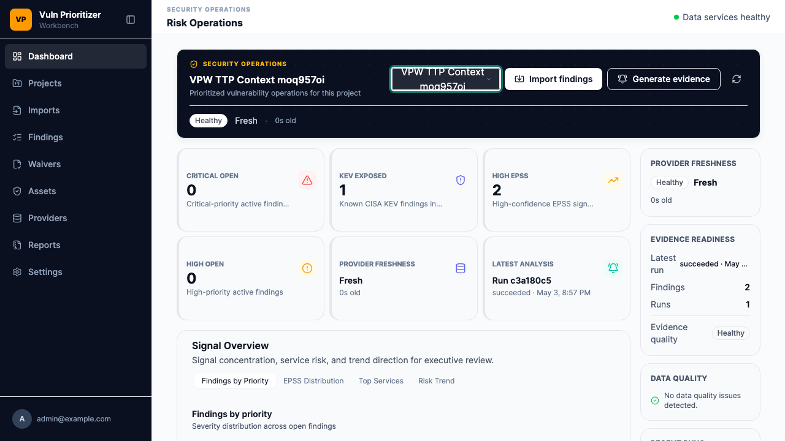

# VPW-059 ATT&CK Summary Dashboard Evidence

## Scope

VPW-059 adds the template-track project ATT&CK summary API and a React/TanStack
dashboard widget for technique concentration review.

Implemented scope:

- Added `GET /api/v1/projects/{project_id}/attack/summary`.
- Aggregates the newest persisted ATT&CK context per finding so re-imports do
  not double-count techniques.
- Reports mapped and unmapped finding counts, mapped coverage, top techniques,
  top tactics, source counts, review status counts, and confidence distribution.
- Dashboard widget renders top techniques and keeps low/unknown confidence
  visible instead of hiding weak mappings.
- Unmapped projects show an explicit empty state.
- The widget uses defensive summary wording only; it does not provide exploit
  procedure, payload, or active probing guidance.

## Screenshot Evidence



Screenshot file:

```text
docs/evidence/vpw-059-attack-summary-dashboard.png
```

## Interpretation

- `Mapped` counts findings with a reviewed ATT&CK context and at least one
  technique.
- `Unmapped` counts findings without reviewed technique context.
- Top techniques are ordered by finding count, then total risk score, then
  technique ID for deterministic display.
- Confidence distribution is a review-quality signal only. Low confidence
  does not modify base CVSS, EPSS, KEV, or operational priority.

## Safety Review

- ATT&CK data is treated as defensive triage context.
- No heuristic, fuzzy, or LLM-generated CVE-to-ATT&CK mapping is introduced.
- No exploit steps, PoC details, payload guidance, active probing, or offensive
  procedure instructions are rendered.

## Commands

```bash
python3 -m pytest -q backend/tests/api/test_template_import_upload_api.py::test_attack_summary_api_rolls_up_top_techniques_and_confidence backend/tests/api/test_template_workbench_api_skeleton.py::test_vpw011_404_and_403_are_consistent_for_project_scoped_resources --no-cov
bash scripts/generate-client.sh
npm --prefix frontend run lint
npm --prefix frontend run build
npm --prefix frontend run test -- template-login-status.spec.ts -g "template finding detail renders TTP Context tab"
make docs-check
make check
```

Result summary:

- Targeted template API tests: 2 passed.
- Frontend lint/build/client generation: passed.
- Targeted frontend Playwright smoke: passed and wrote the screenshot.
- `make docs-check`: passed; existing mkdocs info notes
  `architecture/vpw-011-api-skeleton.md` is outside nav.
- `make check`: 784 passed, 6 skipped, coverage 90.56%.
