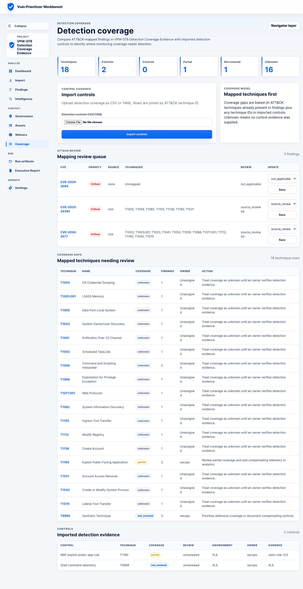

# VPW-079 Detection Coverage Evidence

VPW-079 closes the duplicated roadmap item for defensive detection coverage over
ATT&CK techniques. The implementation keeps the current Workbench architecture:
FastAPI with the local-first Jinja2/SQLAlchemy Workbench remains the interactive
surface for detection controls and coverage gaps. The template report renderer
also supports the same optional evidence-bundle artifact so generated bundles
share one contract.

## Scope Changed or Verified

- Verified existing `DetectionControl` persistence, CSV/YAML import, API CRUD,
  coverage-gap API, coverage-gap Navigator layer, technique detail view, and
  Jinja coverage dashboard.
- Added detection coverage to run report payloads from persisted ATT&CK contexts,
  detection controls, and current run findings.
- Added `governance/detection-coverage.json` to evidence bundles with manifest
  `governance_artifacts` metadata, SHA-256 validation, coverage summary, gap
  items, controls, and explicit limitations.
- Added detection coverage sections to generated Markdown summaries and
  executive HTML reports.
- Added the same optional `governance-detection-coverage` artifact kind to the
  template-stack evidence bundle renderer.
- Updated the published evidence-bundle manifest schema, `analysis-result.v1`
  schema, and contracts.

## Definition of Done

| Requirement | Evidence |
| --- | --- |
| Detection controls and per-technique coverage | `backend/src/vuln_prioritizer/db/models.py`, `backend/src/vuln_prioritizer/api/workbench_detection.py`, `backend/src/vuln_prioritizer/api/workbench_attack_detection_routes.py` |
| Coverage statuses | `covered`, `partial`, `not_covered`, and `unknown` are supported; `not_applicable` remains an explicit reviewed non-applicability state and is not counted as safety. |
| CSV/YAML import | Covered by API and web tests. |
| Dashboard visibility | `docs/evidence/vpw-079-detection-coverage-dashboard.png` |
| Report visibility | `summary.md` includes `## Detection Coverage`; `report.html` includes `Detection Coverage Gaps`. |
| Evidence bundle export | `governance/detection-coverage.json` with manifest kind `governance-detection-coverage`. |
| Run scoping | Detection coverage uses run-scoped ATT&CK contexts and run-scoped current findings; project-wide controls are included as the current defensive control set. |
| JSON schema | Template `analysis-result.v1` validates optional top-level `detection_coverage`. |
| Safety wording | Export limitations and report text state coverage is operator-supplied defensive review evidence, not proof of security or exploitation. |

## Screenshot



## Validation

Targeted coverage:

```text
python3 -m pytest -q backend/tests/api/test_workbench_api.py::test_workbench_detection_controls_coverage_gaps_and_technique_detail backend/tests/api/test_template_reports_api.py::test_vpw079_template_evidence_bundle_includes_detection_coverage_export --no-cov
2 passed
```

Expanded affected suites:

```text
python3 -m pytest -q backend/tests/api/test_workbench_api.py::test_workbench_detection_controls_coverage_gaps_and_technique_detail backend/tests/api/test_workbench_api.py::test_workbench_new_api_error_paths_and_detection_import_validation backend/tests/web/test_workbench_pages.py::test_web_assets_waivers_and_coverage_pages backend/tests/api/test_template_reports_api.py::test_vpw079_template_evidence_bundle_includes_detection_coverage_export backend/tests/api/test_template_reports_api.py::test_vpw068_reports_and_evidence_bundle_export_governance_context backend/tests/test_report_io_helpers.py::test_write_evidence_bundle_handles_missing_input_copy_and_navigator_layer backend/tests/cli/test_report.py::test_workbench_report_lifecycle_overlay_uses_id_and_stable_identity --no-cov
7 passed
```

Template report suite:

```text
python3 -m pytest -q backend/tests/api/test_template_reports_api.py --no-cov
30 passed
```

Workbench API suite:

```text
python3 -m pytest -q backend/tests/api/test_workbench_api.py --no-cov
24 passed
```

Evidence/output contracts:

```text
python3 -m pytest -q backend/tests/test_evidence_bundle_verification.py backend/tests/test_report_io_helpers.py backend/tests/test_v11_output_contracts.py --no-cov
42 passed
```

Docs:

```text
make docs-check
passed
```

Full local gate:

```text
make check
892 passed, 7 skipped, total coverage 90.78%
```

Independent blocker review:

```text
Carver explorer review after schema and run-scope fixes
No blockers found; targeted verification 3 passed
```

Browser evidence:

```text
Playwright screenshot capture against a live local Workbench:
docs/evidence/vpw-079-detection-coverage-dashboard.png
```

## Residual Risk

- React/TanStack template UI parity is not introduced here. VPW-079 is
  implemented in the current approved Workbench surface and the template report
  artifact contract is additive.
- Detection coverage remains supplied evidence from SOC/owner workflows. The
  Workbench does not infer real monitoring effectiveness.
