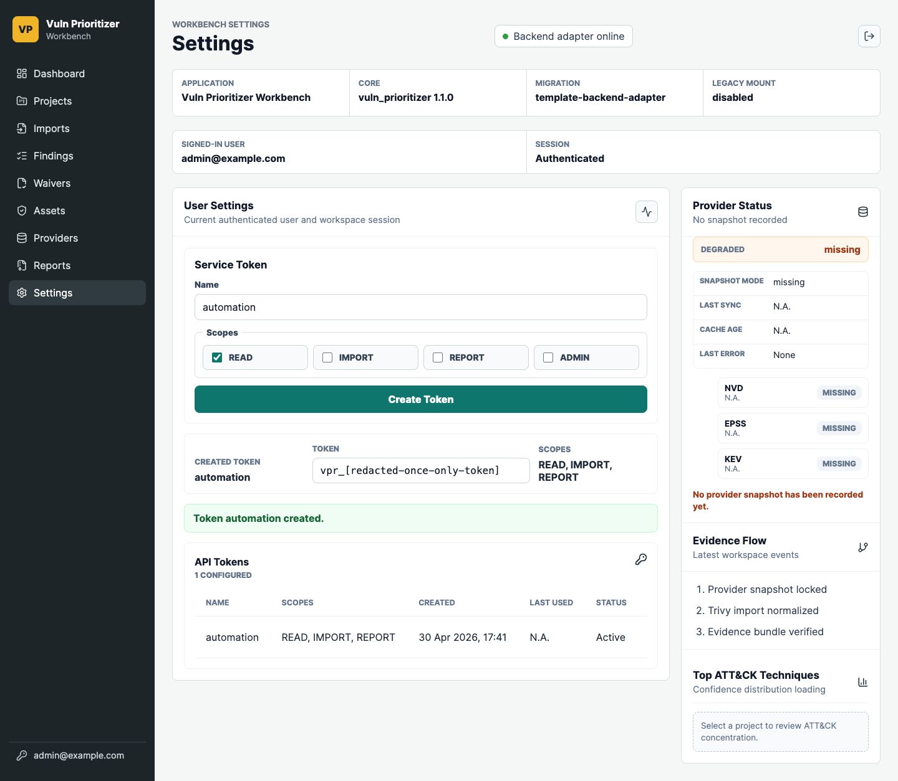

# VPW-081 Scoped API Token Evidence

VPW-081 implements scoped service tokens for the template FastAPI surface and
keeps the legacy Workbench API compatible while removing all-or-nothing token
authorization.

## Scope

- Template API tokens are stored hashed, expose `read`, `import`, `report`, and
  `admin` scopes, and return the cleartext token only in the creation response.
- Template read, import, report, and token-management routes use scope-aware
  dependencies. JWT users keep the existing authenticated user behavior.
- Legacy `/api` tokens persist scopes, default upgraded tokens to `admin`, and
  enforce `read`, `import`, `report`, or `admin` on protected API paths.
- The React settings page creates, lists, and revokes scoped template tokens
  through the generated `/api/v1/api-tokens/` client.

## Browser Evidence

Screenshot:



Artifact path:

```text
docs/evidence/vpw-081-settings-token-ui.png
```

The screenshot shows the settings page after creating a service token with
`READ`, `IMPORT`, and `REPORT` scopes. The one-time cleartext value is redacted
in the evidence artifact; in the live UI it is shown only in the creation panel.
The list table shows token metadata and scopes, not the secret value.

## Validation

| Command | Result |
| --- | --- |
| `python3 -m pytest -q backend/tests/api/test_template_api_tokens.py backend/tests/api/test_template_auth_smoke.py backend/tests/api/test_template_workbench_api_skeleton.py::test_vpw011_domain_routes_require_auth backend/tests/api/test_workbench_api.py::test_workbench_api_tokens_enforce_scopes_for_import_report_and_admin backend/tests/api/test_workbench_api.py::test_workbench_api_tokens_config_provider_jobs_and_github_preview --no-cov` | Passed: 11 tests. |
| `python3 -m pytest -q backend/tests/api/test_template_model_metadata.py backend/tests/db/test_workbench_alembic.py --no-cov` | Passed: 6 tests. |
| `python3 -m pytest -q backend/tests/api/test_template_api_tokens.py backend/tests/api/test_template_import_upload_api.py backend/tests/api/test_template_reports_api.py backend/tests/api/test_template_auth_smoke.py backend/tests/api/test_template_model_metadata.py backend/tests/db/test_workbench_alembic.py backend/tests/api/test_workbench_api.py::test_workbench_api_tokens_enforce_scopes_for_import_report_and_admin backend/tests/api/test_workbench_api.py::test_workbench_api_tokens_config_provider_jobs_and_github_preview --no-cov` | Passed: 81 tests. |
| `cd backend && python3 -m mypy app src` | Passed. |
| `python3 -m ruff check backend/app/api/deps.py backend/app/api/main.py backend/app/api/routes/api_tokens.py backend/app/api/routes/assets.py backend/app/api/routes/findings.py backend/app/api/routes/imports.py backend/app/api/routes/projects.py backend/app/api/routes/providers.py backend/app/api/routes/reports.py backend/app/api/routes/runs.py backend/app/models/api_tokens.py backend/app/repositories/api_tokens.py backend/src/vuln_prioritizer/api/app.py backend/src/vuln_prioritizer/api/token_scopes.py backend/src/vuln_prioritizer/api/workbench_system_routes.py backend/src/vuln_prioritizer/db/migrations.py backend/src/vuln_prioritizer/db/repository_security.py backend/src/vuln_prioritizer/web/workbench_settings.py backend/tests/api/test_template_api_tokens.py backend/tests/api/test_workbench_api.py` | Passed. |
| `make frontend-generate-client` | Passed; generated client includes `/api/v1/api-tokens/`. |
| `npm --prefix frontend run lint` | Passed. |
| `npm --prefix frontend run build` | Passed. |
| `npm --prefix frontend run test` | Passed: 6 tests. |
| `make docs-check` | Passed; MkDocs reported the pre-existing unnaved `docs/architecture/vpw-011-api-skeleton.md`. |
| `make check` | Passed: 887 tests, 7 optional skips, 90.75% total coverage. |
| `make playwright-check` | Passed: 3 tests. |
| `make docker-demo-smoke` | Passed. |
| `make docker-postgres-migration-smoke` | Passed. |
| `rg -n --hidden --glob '!.git/**' --glob '!node_modules/**' --glob '!frontend/node_modules/**' --glob '!site/**' --glob '!build/**' --glob '!backend/build/**' --glob '!frontend/dist/**' 'vpr_[A-Za-z0-9_\\[\\]-]+' .` | Passed: no cleartext service-token strings found in the working tree after removing local Playwright artifacts. |

## Residual Risk

- Scoped service tokens are a single-workspace self-hosted feature. Shared,
  public, or SaaS deployment still requires the broader deployment hardening
  described in the Workbench threat model.
- Existing legacy databases without `api_tokens.scopes_json` are upgraded
  additively; existing active tokens are treated as `admin` so compatibility is
  preserved instead of silently breaking automation.
