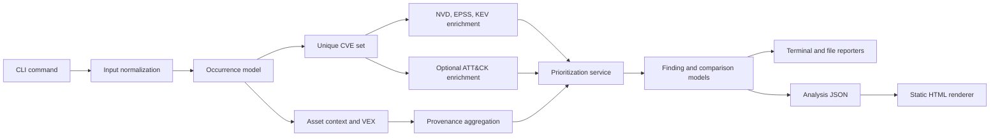

# Architecture

## Scope

`vuln-prioritizer` is a CLI for prioritizing known CVEs. It is not a scanner, does not discover vulnerabilities on its own, and does not perform heuristic or LLM-generated CVE-to-ATT&CK mapping.

The current runtime architecture keeps one invariant across all supported inputs:

- normalize many source formats into occurrence-level CVE evidence
- deduplicate to a unique CVE set for enrichment and base prioritization
- preserve provenance, asset context, and VEX applicability as explainable context
- render the same finding model into terminal, Markdown, JSON, SARIF, and HTML surfaces

## Flow

## Layering

### CLI surface

`src/vuln_prioritizer/cli.py` is the CLI composition root. It assembles the public Typer tree, shared runtime defaults, and cross-command wiring, while private command modules and private support modules hold command handlers and reusable CLI-only helpers.

Current public command groups:

- `analyze`
- `compare`
- `explain`
- `attack validate`
- `attack coverage`
- `attack navigator-layer`
- `data status`
- `data update`
- `data verify`
- `report html`

The command layer owns flag parsing, validation, cache wiring, and output-mode dispatch. The public command tree is part of the CLI surface; the private command/support modules are implementation detail and do not widen the architecture boundary. Parser-specific logic remains below this layer apart from compatibility routing.

### Input normalization

`src/vuln_prioritizer/inputs/loader.py` is the canonical input entry point.

Current normalized types:

- `InputOccurrence`: one source occurrence of a CVE, including component, path, target, asset, and VEX fields
- `ParsedInput`: normalized input document with `occurrences`, `unique_cves`, `warnings`, and `source_stats`

Supported input families currently normalize into the same occurrence model:

- line-oriented CVE lists
- scanner JSON
- SBOM JSON
- advisory/export JSON

`src/vuln_prioritizer/parser.py` remains a backward-compatible façade for historical `.txt` and `.csv` CVE-list flows and delegates internally to the loader.

### Provenance, asset context, and VEX

`src/vuln_prioritizer/services/contextualization.py` aggregates occurrence-level data into per-CVE provenance and context.

Important current rules:

- asset context is occurrence-based, keeps `target_kind` exact, and supports deterministic
  `target_ref` exact/glob rules with precedence
- VEX suppression is evaluated at occurrence level with deterministic specificity-based matching
- `suppressed_by_vex` is true only when all known occurrences are suppressed
- `under_investigation` stays visible and is not silently removed

This layer produces:

- `FindingProvenance`
- `ContextPolicyProfile`
- derived context summary and context recommendation text

### Enrichment providers

`src/vuln_prioritizer/services/enrichment.py` and the provider modules fetch external or local enrichment data.

Current data sources:

- NVD for CVSS, description, references, and selected metadata
- FIRST EPSS
- CISA KEV
- optional local ATT&CK mappings from `local-csv` or `ctid-json`

ATT&CK remains optional and file-based. There is no required remote ATT&CK dependency in the current design.

### Prioritization

`src/vuln_prioritizer/services/prioritization.py` builds the primary finding set.

The base `priority_label` is intentionally rule-based and transparent:

- `Critical`: KEV or high EPSS+CVSS threshold combination
- `High`: high EPSS or high CVSS
- `Medium`: medium EPSS or medium CVSS
- `Low`: everything else

Current architectural boundary:

- `priority_label` is driven by CVSS, EPSS, and KEV
- ATT&CK, asset context, and VEX add context, rationale, or suppression semantics
- ATT&CK and asset context do not silently introduce a separate opaque risk score

### Reporting

`src/vuln_prioritizer/reporter.py` remains the public reporting facade and delegates report-format, JSON/payload, and serialization helpers to private internal reporting modules.

Current output families:

- terminal tables and panels for interactive use
- Markdown reports for human-readable artifacts
- JSON exports for machine consumption
- SARIF for `analyze`
- static HTML rendered from a previously exported analysis JSON payload

The machine boundary is the JSON export, not the terminal or Markdown layout.

## Contract boundaries

### Stable machine-readable boundary

The current machine-facing contract is centered on the JSON exports:

- analysis JSON
- compare JSON
- explain JSON

These payloads embed `metadata.schema_version`, currently `1.0.0`.

### Derived renderers

`report html` does not rerun enrichment. It consumes an existing analysis JSON export and renders a static document from that saved payload. This keeps HTML generation reproducible and decoupled from live provider state.

### Human-facing surfaces

Terminal tables, panels, warning phrasing, and Markdown table layout are intentionally optimized for readability. They are user-visible interfaces, but not machine-stable parsing targets.

## Cache and live data

NVD, EPSS, and KEV remain live/cache-backed data sources.

The current `data` command tree is intentionally small:

- `data status` inspects namespace counts, timestamps, and local ATT&CK metadata
- `data update` refreshes NVD/EPSS per-CVE cache entries and the cached KEV catalog
- `data verify` inspects cache coverage, namespace checksums, and pinned local file checksums

Important boundary:

- `data update` is cache-oriented, not a full mirror or snapshot framework for upstream feeds
- NVD and EPSS updates are still scoped to the requested CVE set, not to the whole upstream corpus
- ATT&CK remains local-file based and is verified from disk rather than refreshed from a remote feed

For reproducible automation, prefer:

- explicit `--input-format` over auto-detection
- JSON exports with schema validation
- pinned local ATT&CK mapping files when ATT&CK context is required
