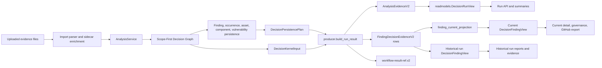

# Decision/Evidence Kernel

## Scope

The Decision/Evidence Kernel is the active source-of-truth boundary for
successful Workbench imports. It converts one parsed, enriched, and persisted
import into a typed `DecisionRunResult` before the import workflow is marked
terminal.

This page describes the current kernel-first architecture. It is not a legacy
compatibility promise for older local runs or old free-form workflow result
payloads.

## Owner Files

| Layer | Owner | Responsibility |
| --- | --- | --- |
| Scope decision graph | `backend/app/decision_core/decision_graph.py`, `backend/app/decision_core/identity.py` | Separate shared CVE facts from scoped finding decisions, own versioned observation/finding identity, global ranking, and deterministic replay fingerprints. |
| Kernel producer | `backend/app/decision_core/producer.py` | Build `DecisionRunResult` from typed import, persistence, sidecar, provider, and analysis inputs. |
| Public contracts | `backend/app/decision_core/contracts.py` | Validate `AnalysisEvidenceV2`, `FindingDecisionEvidenceV2`, `OccurrenceEvidenceV2`, and `RunDiagnosticsV2`. |
| Import orchestration | `backend/app/services/import_execution.py` | Store uploads, run parser/enrichment, persist findings/occurrences, call the kernel, persist evidence, and close the workflow. |
| Persistence summary adapters | `backend/app/services/import_execution_persistence.py`, `backend/app/services/import_execution_persistence_bulk.py` | Persist relational records and return the typed summary consumed by `DecisionPersistencePlan`. |
| Evidence repository | `backend/app/repositories/evidence.py` | Prepare/finalize immutable run evidence, append immutable per-run finding evidence, and dual-write current projections. |
| Current projection repository | `backend/app/repositories/current_projections.py` | Materialize current state, apply lifecycle-only changes, backfill, and verify hashes/columns/coverage. |
| Evidence read model | `backend/app/decision_core/readmodels.py` | Centralize immutable run views and current-projection finding, occurrence, report, dashboard, governance, and GitHub issue views. |
| Public projections | `backend/app/services/run_workflow_projection.py`, `backend/app/services/finding_projection.py`, `backend/app/services/dashboard.py`, `backend/app/services/governance.py`, `backend/app/services/decisions.py`, `backend/app/services/github_issues.py`, `backend/app/services/report_projection.py`, `backend/app/services/report_service_payload.py` | Map central decision views into stable API, finding detail, dashboard, waiver/governance, GitHub issue preview, and report payloads. |

`backend/app/decision_core/builders.py` remains an adapter module for
diagnostics, finding-level builders, and public payload-boundary helpers. It is
not the product kernel for successful imports.

## Data Flow



## Scope-First Input Semantics

The Decision Graph is the internal semantic input to persistence and the v2
producer. Provider, data-quality, ATT&CK, and defensive-context facts remain
shared by normalized CVE. The graph groups observations by normalized CVE,
component identity, target kind, and source target reference before deriving provenance, VEX
state, remediation, priority evidence, operational score, explanation,
guidance, and rank. It then assigns one globally unique rank across all final
finding scopes.

This graph is not a third public decision contract. Persistence selects the
matching scoped decision in constant time and projects it into the existing
`FindingDecisionEvidenceV2` shape. `AnalysisEvidenceV2.analysis_semantics`
records `finding_scope_first`, `decision_graph_materialization`, the
`finding-scope-v2` identity version, an empty semantic overlay list, and the
graph replay hashes. See
[Scope-First Decision Graph](scope-first-decision-graph.md) for the identity,
shared/scoped split, and replay rules.

## Kernel Output

`DecisionRunResult` contains:

- `analysis_evidence`: bounded run-wide `AnalysisEvidenceV2`
- `finding_evidence`: per-finding `FindingDecisionEvidenceV2` rows
- `summary_counts`: typed counters used for API summaries and workflow details
- `workflow_result`: compact `workflow-result-ref.v2`
- `workflow_details`: small lifecycle metadata for workflow events
- `artifact_refs`: report/provider artifact references when produced by that
  execution path

Run-wide evidence must remain bounded. It may contain counts, upload refs,
provider facts, warnings, parse errors, sidecar summaries, dedup summaries, and
ATT&CK rollup state, but it must not embed the full finding decision list.

Per-run finding decision truth lives immutably in
`finding_decision_evidence`. That includes
priority, provider evidence, governance state, remediation guidance, ATT&CK
context, occurrence evidence, waiver state, VEX state, and raw explanation
material needed for explain/report projections. Effective current state lives
in `finding_current_projection`, which links to its source evidence and may
advance with a newer run or explicit lifecycle action without rewriting that
source. It stores indexed current fields and only a sparse lifecycle overlay;
read models reconstruct and validate the effective payload from source plus
overlay.

## Workflow Result Boundary

Successful import workflows write only a reference payload to
`workflow_run.result_ref_json`:

```json
{
  "schema_version": "workflow-result-ref.v2",
  "analysis_evidence_id": "<uuid>",
  "artifact_refs": []
}
```

Counts, provider facts, findings, dedup decisions, sidecar summaries, and report
semantics must not be reconstructed from successful workflow result JSON. Failed
or cancelled workflows may still expose typed diagnostics through
`RunDiagnosticsV2`.

## Projection Rules

Projection code should follow these rules:

- Select the final scope decision before building evidence; do not use a
  CVE-wide decision as a semantic fallback when a scoped graph is present.
- Project VEX, provenance, remediation, score, explanation, guidance, and rank
  from that one scoped decision without cross-scope overlays.
- Run APIs read successful output facts from `AnalysisEvidenceV2`.
- Current finding list/detail payloads read decision fields and occurrence
  evidence from `DecisionFindingView` backed by `finding_current_projection`.
- Historical run payloads and run-specific reports read the immutable
  `finding_decision_evidence` rows for that run.
- Reports, dashboard, waiver/governance views, and GitHub issue previews use
  the same central decision views as API and UI projections.
- SQL tables such as `finding`, `finding_occurrence`, and `analysis_run` remain
  useful for identities, pagination, sorting, relational joins, and lifecycle
  state, but not as a second source of decision semantics.
- Public DTO shapes remain stable. The evidence-first read model is an internal
  projection boundary, not a new public API surface.
- Missing `analysis_evidence` for a successful v2 import is inconsistent state,
  not a reason to rebuild product facts from workflow JSON.
- Missing per-finding `FindingDecisionEvidenceV2` for a successful run finding
  is inconsistent state, not a reason to fall back to `finding` decision
  columns.

## Contract Tests

The kernel-first path is protected by:

- `backend/tests/test_scope_first_decision_graph.py`
- `backend/tests/api/import_contracts/test_scope_first_import_contract.py`
- `backend/tests/api/import_contracts/test_kernel_first_import_contract.py`
- `backend/tests/api/import_contracts/`
- `backend/tests/api/report_contracts/`
- `backend/tests/api/workflow_contracts/`
- `backend/tests/test_decision_projection.py`
- `backend/tests/test_decision_ledger.py`
- `backend/tests/test_docs_hygiene.py`

Run the focused documentation and contract checks after changing this page or
the kernel boundary:

```bash
python3 -m pytest -q backend/tests/test_docs_hygiene.py --no-cov
python3 -m pytest -q backend/tests/api/import_contracts backend/tests/api/report_contracts backend/tests/api/workflow_contracts --no-cov
make docs-check
```
