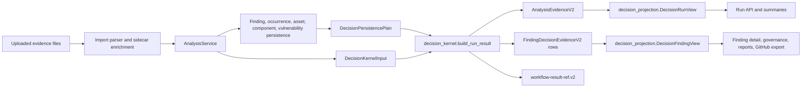

# Decision/Evidence Kernel

## Scope

The Decision/Evidence Kernel is the active source-of-truth boundary for
successful Workbench imports. It converts one parsed, enriched, and persisted
import into a typed `DecisionRunResult` before the import workflow is marked
terminal.

This page describes the current kernel-first architecture. It is not a legacy
compatibility promise for older local runs or old free-form workflow result
payloads.

## Owner Files

| Layer | Owner | Responsibility |
| --- | --- | --- |
| Kernel producer | `backend/app/services/decision_kernel.py` | Build `DecisionRunResult` from typed import, persistence, sidecar, provider, and analysis inputs. |
| Public contracts | `backend/app/contracts/decision_evidence.py` | Validate `AnalysisEvidenceV2`, `FindingDecisionEvidenceV2`, `OccurrenceEvidenceV2`, and `RunDiagnosticsV2`. |
| Import orchestration | `backend/app/services/import_execution.py` | Store uploads, run parser/enrichment, persist findings/occurrences, call the kernel, persist evidence, and close the workflow. |
| Persistence summary adapters | `backend/app/services/import_execution_persistence.py`, `backend/app/services/import_execution_persistence_bulk.py` | Persist relational records and return the typed summary consumed by `DecisionPersistencePlan`. |
| Evidence repository | `backend/app/repositories/evidence.py` | Upsert run-wide evidence and replace per-finding decision evidence. |
| Evidence read model | `backend/app/services/decision_projection.py` | Centralize evidence-first run, finding, occurrence, report, dashboard, governance, and GitHub issue read views. |
| Public projections | `backend/app/services/run_workflow_projection.py`, `backend/app/services/finding_projection.py`, `backend/app/services/dashboard.py`, `backend/app/services/governance.py`, `backend/app/services/decisions.py`, `backend/app/services/github_issues.py`, `backend/app/services/report_projection.py`, `backend/app/services/report_service_payload.py` | Map central decision views into stable API, finding detail, dashboard, waiver/governance, GitHub issue preview, and report payloads. |

`backend/app/services/decision_evidence_builder.py` remains an adapter module for
diagnostics, finding-level builders, and public payload-boundary helpers. It is
not the product kernel for successful imports.

## Data Flow



## Kernel Output

`DecisionRunResult` contains:

- `analysis_evidence`: bounded run-wide `AnalysisEvidenceV2`
- `finding_evidence`: per-finding `FindingDecisionEvidenceV2` rows
- `summary_counts`: typed counters used for API summaries and workflow details
- `workflow_result`: compact `workflow-result-ref.v2`
- `workflow_details`: small lifecycle metadata for workflow events
- `artifact_refs`: report/provider artifact references when produced by that
  execution path

Run-wide evidence must remain bounded. It may contain counts, upload refs,
provider facts, warnings, parse errors, sidecar summaries, dedup summaries, and
ATT&CK rollup state, but it must not embed the full finding decision list.

Per-finding decision truth lives in `finding_decision_evidence`. That includes
priority, provider evidence, governance state, remediation guidance, ATT&CK
context, occurrence evidence, waiver state, VEX state, and raw explanation
material needed for explain/report projections.

## Workflow Result Boundary

Successful import workflows write only a reference payload to
`workflow_run.result_json`:

```json
{
  "schema_version": "workflow-result-ref.v2",
  "analysis_evidence_id": "<uuid>",
  "artifact_refs": []
}
```

Counts, provider facts, findings, dedup decisions, sidecar summaries, and report
semantics must not be reconstructed from successful workflow result JSON. Failed
or cancelled workflows may still expose typed diagnostics through
`RunDiagnosticsV2`.

## Projection Rules

Projection code should follow these rules:

- Run APIs read successful output facts from `AnalysisEvidenceV2`.
- Finding list/detail payloads read decision fields and occurrence evidence from
  `DecisionFindingView`.
- Reports, dashboard, waiver/governance views, and GitHub issue previews use
  the same central decision views as API and UI projections.
- SQL tables such as `finding`, `finding_occurrence`, and `analysis_run` remain
  useful for identities, pagination, sorting, relational joins, and lifecycle
  state, but not as a second source of decision semantics.
- Public DTO shapes remain stable. The evidence-first read model is an internal
  projection boundary, not a new public API surface.
- Missing `analysis_evidence` for a successful v2 import is inconsistent state,
  not a reason to rebuild product facts from workflow JSON.
- Missing per-finding `FindingDecisionEvidenceV2` for a successful run finding
  is inconsistent state, not a reason to fall back to `finding` decision
  columns.

## Contract Tests

The kernel-first path is protected by:

- `backend/tests/api/import_contracts/test_kernel_first_import_contract.py`
- `backend/tests/api/import_contracts/`
- `backend/tests/api/report_contracts/`
- `backend/tests/api/workflow_contracts/`
- `backend/tests/test_decision_projection.py`
- `backend/tests/test_docs_hygiene.py`

Run the focused documentation and contract checks after changing this page or
the kernel boundary:

```bash
python3 -m pytest -q backend/tests/test_docs_hygiene.py --no-cov
python3 -m pytest -q backend/tests/api/import_contracts backend/tests/api/report_contracts backend/tests/api/workflow_contracts --no-cov
make docs-check
```
