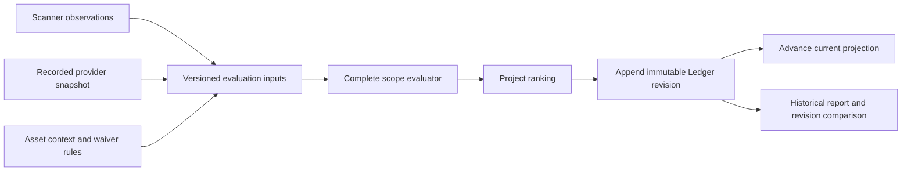

# Reproducible evaluation revisions

The Workbench evaluates existing findings without importing the scanner data again.
An evaluation records the facts and rules used for the decision, appends a new entry
to the existing Decision Ledger and advances the current project view. A later
provider snapshot or asset edit does not change a historical report.

## Inputs, outputs and identity

`ScopeEvaluationInput` (`scope-evaluation-input.v1`) records normalized observations,
provider facts, ATT&CK facts, context and priority policies, source-file waiver rules,
the effective Workbench waiver, quality flags, defensive context and evaluation date.
Its canonical SHA-256 and the explicit engine version identify the replay inputs.
`evaluate_scope` performs a complete offline evaluation: score, priority, rationale,
context, recommendations, governance and guidance come from this transformation.
It rejects mixed CVEs, mixed finding scopes and unsupported engine versions.

The import pipeline enriches CVEs once and evaluates each final scope once. Asset
and waiver changes use the same evaluator through `DecisionProjectionService`.
Project-wide ranking is a separate step using the existing canonical domain order.
The observation and finding dedup keys retain their existing versions.

The stored input is not another decision store. The existing
`AnalysisEvidence` and `FindingDecisionEvidence` remain the authoritative outputs.
Native runs use `input_type=reevaluation` and create no new scanner occurrences.
Manual work states are preserved unless an effective governance decision requires
a fixed, suppressed or accepted state. Missing a CVE in a later scan is not proof
that it was fixed.

## User and API workflow

Use **Re-evaluate** on the project dashboard or a finding. Choose the recorded facts
or an available provider snapshot. The dialog shows the durable workflow status;
the finding history shows the new revision and changes from its predecessor.

- `POST /api/v1/projects/{project_id}/evaluations`: queue a native evaluation.
  The optional body accepts `finding_ids`, `provider_snapshot_id` and `reason`.
- `GET /api/v1/projects/{project_id}/evaluations`: list native evaluation runs,
  including immediate revisions caused by asset recalculation or waiver changes.
- `GET /api/v1/findings/{finding_id}/decision-revisions`: paginated immutable
  revisions with evaluated/observed timestamps, origin, input fingerprint,
  replay availability, current-source marker and changed fields.

The chosen provider artifact must exist within the managed snapshot directory or
be the bundled demo artifact and must match its recorded content hash. A missing
source in that snapshot is represented by missing facts and quality flags; old
provider facts are not silently mixed into the new snapshot. Re-evaluation does
not fetch live providers. Provider refresh and adoption are separate operations.

`observed_at` describes the retained scanner observation; `evaluated_at` describes
the decision. Re-evaluation does not update `Finding.last_seen_at`. Metadata is
captured on new imports and native revisions. Historical rows with no observation
timestamp expose an unknown value instead of using the current finding timestamp.
Persisted append timestamps advance monotonically even when the system clock is
frozen or moves backwards, so a newer source cannot lose to an unrelated UUID tie.

## Concurrency and publication

Migration `20260906_0010` adds `Project.decision_revision`, initially zero. Existing
rows and historical JSON payloads are not rewritten. A project mutation advances
this token under the project lock. Computation captures the token before reading
inputs; publication compares and advances it atomically. A concurrent project edit
therefore rejects the stale result before any new decision is published.

Workers commit setup and progress in short transactions. Parsing, provider work,
rendering and evaluation run without retaining a SQLite writer lock. The final
transaction contains domain rows, immutable evidence, the current projection and
the terminal workflow result together. Cancellation reads the database control
state rather than a cached ORM object. Worker attempts fence publication and lease
renewals; an independent heartbeat keeps long computations leased.

Report retention deletes retired artifacts after the metadata transaction commits.
Rollback removes newly created artifacts while retaining older report files.

## Historical compatibility

Old Decision/Evidence v2 payloads remain readable. Optional new metadata is additive;
there is no migration that invents the original policy, provider facts or observations.
Rows without complete canonical inputs have `replay_status=legacy_unavailable`.
A native evaluation including such a row returns a conflict explaining that its
source must be imported again. Asset recalculation keeps these findings marked as
requiring re-evaluation rather than reporting a complete recalculation.

Scope IDs, source observations, old reports and historical evidence remain intact.
The existing local single-user FastAPI, React and SQLite deployment remains the
supported architecture. This change does not add scan-coverage claims or persistent
remediation plans.

## Risk and guidance semantics

`mean-actionable-score.v1` is the average score of actionable findings. A remediation
simulation removes the selected finding count from the denominator as well as its
score from the numerator. The total score can decrease while the remaining average
increases; the UI and HTML reports distinguish these quantities. Opportunity links
carry exact finding IDs and canonical component identities.

Executive recommendations and SLA labels come from recorded decision guidance.
A critical count alone does not establish production exposure or exploitation.
Missing legacy guidance is displayed as unavailable.

## Delivery evidence

The implementation checklist and validation record are maintained in
[the delivery plan](evaluation-revisions-plan.md). Tests use isolated databases and
local provider fixtures. Browser tests also run the real worker. No provider scan,
GitHub issue publication or deployment is required by this implementation.
