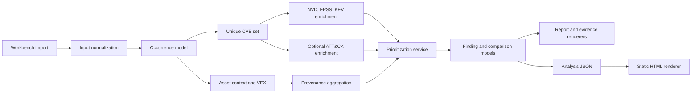

# Architecture

## Scope

`vuln-prioritizer` is a local Workbench for prioritizing known CVEs. It is not
a scanner, does not discover vulnerabilities on its own, and does not perform
heuristic or LLM-generated CVE-to-ATT&CK mapping. Legacy CLI entrypoints and
command modules have been removed; the retained `backend/src/vuln_prioritizer`
code is shared domain logic used by the Workbench.

The current runtime architecture keeps one invariant across all supported inputs:

- normalize many source formats into occurrence-level CVE evidence
- deduplicate to a unique CVE set for enrichment and base prioritization
- preserve provenance, asset context, and VEX applicability as explainable context
- render the same finding model into Workbench API/UI, Markdown, JSON, SARIF,
  HTML, and evidence surfaces

## Flow

## Layering

### Workbench surface

The active Workbench app is the FastAPI backend in `backend/app` plus the
React/Vite/TanStack frontend in `frontend`. Docker Compose, Playwright startup,
and generated OpenAPI client creation point to `app.main:app`.

Workbench runtime state is controlled by active backend environment variables
for database URL, upload directory, report directory, trusted provider snapshot
directory, provider cache directory, upload size, and NVD API-key environment
name. The Docker Compose path uses named volumes for writable runtime state,
keeps provider snapshots writable for refresh jobs, and mounts checked-in demo
data read-only so startup can seed locked demo snapshots without making fixture
data mutable.

The current web/API import path uses the local input-format matrix for
single-upload and multi-upload imports: CVE lists, generic occurrence CSV,
Trivy JSON, Grype JSON, Dependency-Check JSON, GitHub alerts JSON, CycloneDX
JSON, SPDX JSON, Nessus XML, and OpenVAS XML. XML support remains safe local
parsing of exported findings only; the Workbench does not scan systems.

The Workbench threat model and readiness checklist are maintained in
[workbench-threat-model.md](../workbench-threat-model.md). The current
architecture uses local single-user browser/API access without active login,
RBAC, API tokens, or session cookies, assumes a trusted local operator,
supports SQLite default storage, and does not certify public-internet exposure
until the shared-deployment controls are configured and verified for the exact
candidate.

The current project access decision is documented in
[VPW-029 Access Model](vpw-029-access-model-and-admin-tokens.md): active
project-scoped routes check that the project exists and otherwise return 404.
Project membership tables, API tokens, and project-admin RBAC are not part of
the current local-first active scope.

### Input normalization

`backend/src/vuln_prioritizer/inputs/loader.py` is the canonical input entry point.

The Workbench import boundary is documented in
[vpw-013-importer-contract.md](vpw-013-importer-contract.md). It defines the
pure importer protocol, normalized occurrence DTO, registry lookup behavior,
and the rule that parser adapters stay free of FastAPI, database, repository,
and provider dependencies.

Current normalized types:

- `InputOccurrence`: one source occurrence of a CVE, including component, path, target, asset, and VEX fields
- `ParsedInput`: normalized input document with `occurrences`, `unique_cves`, `warnings`, and `source_stats`

Supported input families currently normalize into the same occurrence model:

- line-oriented CVE lists
- scanner JSON
- SBOM JSON
- advisory/export JSON

The old `backend/src/vuln_prioritizer/parser.py` compatibility facade has been
removed. Active Workbench and domain code should use `InputLoader`, importer
adapters, or the focused parser modules under
`backend/src/vuln_prioritizer/inputs/parsers/`.

### Provenance, asset context, and VEX

`backend/src/vuln_prioritizer/services/contextualization.py` aggregates occurrence-level data into per-CVE provenance and context.

Important current rules:

- asset context is occurrence-based, keeps `target_kind` exact, and supports deterministic
  `target_ref`/`asset_ref` `exact`, `contains`, `regex`, and compatibility `glob`
  rules with precedence; see [Asset Context CSV](../asset-context-csv.md)
- VEX suppression is evaluated at occurrence level with deterministic specificity-based matching
- `suppressed_by_vex` is true only when all known occurrences are suppressed
- `under_investigation` stays visible and is not silently removed

This layer produces:

- `FindingProvenance`
- `ContextPolicyProfile`
- derived context summary and context recommendation text

### Enrichment providers

`backend/src/vuln_prioritizer/services/enrichment.py` and the provider modules fetch external or local enrichment data.

Current data sources:

- NVD for CVSS, description, references, and selected metadata
- FIRST EPSS
- CISA KEV
- optional local ATT&CK mappings from `local-csv` or `ctid-json`

ATT&CK remains optional and file-based. There is no required remote ATT&CK dependency in the current design.

The parser/provider extension SDK is a static local contract. It documents typed parser and provider definitions, fixture expectations, and validation helpers, but it does not load remote code, discover arbitrary Python entry points, or import user-supplied plugin paths.

### Prioritization

`backend/src/vuln_prioritizer/services/prioritization.py` builds the primary finding set.

The base `priority_label` is intentionally rule-based and transparent:

- `Critical`: KEV or high EPSS+CVSS threshold combination
- `High`: high EPSS or high CVSS
- `Medium`: medium EPSS or medium CVSS
- `Low`: everything else

Current architectural boundary:

- `priority_label` is driven by CVSS, EPSS, and KEV
- ATT&CK, asset context, and VEX add context, rationale, or suppression semantics
- `priority_state` adds the lifecycle enum values `Suppressed`, `Accepted`, and `Fixed`
- `operational_score` is a transparent 0-100 queueing score with explicit reasons; asset context can affect that score, but not the base `priority_label`
- ATT&CK does not silently introduce a separate opaque risk score

### Reporting

The old `backend/src/vuln_prioritizer/reporter.py` facade has been removed.
Active report generation is owned by the Workbench services under
`backend/app/services/report_*` plus framework-neutral renderers under
`backend/src/vuln_prioritizer/reporting_*`.

Current output families:

- Markdown reports for human-readable artifacts
- JSON exports for machine consumption
- SARIF report artifacts
- CSV findings exports
- static executive HTML rendered from Workbench report payloads
- evidence ZIP bundles with manifest and verification output

The machine boundary is the JSON/export and evidence manifest data, not the
Markdown or HTML layout.

## Contract boundaries

### Stable machine-readable boundary

The current machine-facing contract is centered on the JSON exports:

- analysis JSON
- compare JSON
- explain JSON

These payloads embed `metadata.schema_version`, currently `1.0.0`.

### Derived renderers

HTML report rendering does not rerun enrichment. It consumes an existing
analysis JSON export and renders a static document from that saved payload.
This keeps HTML generation reproducible and decoupled from live provider state.

### Human-facing surfaces

Workbench tables, report panels, warning phrasing, Markdown layout, and HTML
layout are intentionally optimized for readability. They are user-visible
interfaces, but not machine-stable parsing targets.

## Cache and live data

NVD, EPSS, and KEV remain live/cache-backed data sources.

The shared provider enrichment contract is documented in
[VPW-022 Provider Cache, Status and Snapshots](vpw-022-provider-cache-status-snapshots.md).
The EPSS-specific batch/cache/freshness behavior is documented in
[VPW-023 EPSS Provider Cache](vpw-023-epss-provider-cache.md).
The KEV-specific JSON/CSV normalization, fixture, source-hash, and Workbench
detail behavior is documented in
[VPW-024 KEV Provider Cache](vpw-024-kev-provider-cache.md).
The NVD-specific CVE API, fallback, CVSS parsing, and missing-CVSS
data-quality behavior is documented in
[VPW-025 NVD Provider Fallback](vpw-025-nvd-provider-fallback.md).
The provider snapshot format, Workbench import/export API, locked replay, and
evidence-bundle inclusion behavior is documented in
[VPW-026 Provider Snapshot Replay](vpw-026-provider-snapshot-replay.md).
The finding-scoped provider data-quality flags and confidence behavior are
documented in
[VPW-027 Provider Data Quality Flags](vpw-027-provider-data-quality-flags.md).
The Workbench provider status API and React status-card evidence expectations
are documented in
[VPW-028 Provider Status API Card](vpw-028-provider-status-api-card.md).

The current provider update surface is intentionally small:

- provider status APIs inspect namespace counts, timestamps, and local ATT&CK
  metadata
- provider update services refresh NVD/EPSS per-CVE cache entries and the cached
  KEV catalog
- provider validation checks cache coverage, namespace checksums, and pinned
  local file checksums

Important boundary:

- provider updates are cache-oriented, not a full mirror or snapshot framework for upstream feeds
- NVD and EPSS updates are still scoped to the requested CVE set, not to the whole upstream corpus
- ATT&CK remains local-file based and is verified from disk rather than refreshed from a remote feed

For reproducible automation, prefer:

- explicit Workbench `input_type` values over auto-detection
- JSON exports with schema validation
- pinned local ATT&CK mapping files when ATT&CK context is required
