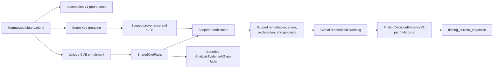

# Scope-First Decision Graph

## Status And Scope

The Scope-First Decision Graph is the active internal analysis model for
Workbench imports. It separates facts that are true for a CVE from decisions
that are true only for one affected component and asset or target.

It is an additive internal boundary. It does not add a database table and it
does not replace Workflow v2 or Decision/Evidence Kernel v2. Persistence
projects the graph into the existing
`AnalysisEvidenceV2`/`FindingDecisionEvidenceV2` contracts and the Decision
Ledger. Those v2 DTOs remain backward compatible and gain only optional
fingerprint, observation-identity, and typed asset-context fields.

## Semantic Split

| Layer | Identity | Current contents |
| --- | --- | --- |
| Shared CVE facts | normalized CVE | NVD/CVSS, EPSS, CISA KEV, ATT&CK mappings, defensive context, and provider data-quality evidence |
| Scoped finding decision | CVE + component identity + source target kind/reference | scoped provenance, VEX/applicability, remediation evidence, priority state, operational score and reasons, explanation, guidance, and global work-queue rank |
| Source observation | source record + CVE alias | scanner/import provenance such as source, source record ID, source ID, paths, and raw evidence |

Provider lookup and base CVSS/EPSS/KEV classification remain CVE-oriented. The
graph does not fetch the same provider facts once per asset. It groups
normalized observations by their final finding scope and then reuses those
shared facts while recomputing every context-dependent decision field for that
scope.



## Identity Contracts

Identity is versioned in `backend/app/decision_core/identity.py`.

### `observation-v1`

An observation identifies one source record and CVE alias. Its canonical
material is:

- normalized source
- source record ID
- normalized CVE
- source ID

The stable key uses the `vpw-observation-v1:` prefix. Observation identity is
provenance identity; it does not decide whether two records describe the same
Workbench finding. Optional values remain JSON `null` in the canonical key
material; no user-enterable string acts as a missing-value sentinel. Source
record IDs and source IDs are trimmed at their boundaries but deliberately not
Unicode-normalized: they are upstream-assigned provenance identifiers, so two
byte-distinct values remain two observations even when they render alike.

### Analysis `ScopeKey`

Analysis is project-neutral. `ScopeKey` contains:

- normalized CVE
- normalized component identity
- normalized source target kind
- normalized source target reference, falling back to an asset ID only when the
  source has no target reference

`source_id` is deliberately absent. Two scanners can contribute observations
to the same finding scope without creating two findings or two independently
scored decisions. Target kind, target reference, and fallback asset ID share
the frozen `nfc-v1` normalization with `vpw-asset-identity-v2`; target kind is
then case-folded. Canonically equivalent NFC/NFD labels therefore resolve to
one scope and one asset identity.

### Persisted `finding-scope-v2`

Persistence adds `project_id` to the project-neutral `ScopeKey` material and
hashes the resulting `FindingScopeIdentity` with the
`vpw-finding-scope-v2:` prefix. Component identity is a tagged canonical JSON
value. It prefers a parsed PURL with ecosystem-specific case semantics; without
a PURL it encodes Unicode-NFC component name, version, and package type as
separate fields. A versioned PURL is authoritative, while a separate version is
retained in the identity of a versionless PURL. The v1 PURL canonicalizer is
frozen to `packageurl-python==0.17.6`; changing canonicalization requires an
identity-v2 migration. Field delimiters inside user data therefore cannot
redistribute identity. The
source target reference takes precedence over `asset_id`, and target kind is
part of the hash. Missing identity parts remain typed JSON `null`, distinct
from every literal input string.

The finding identity is therefore:

```text
project_id + normalized CVE + component identity + target kind + source target reference
```

`source_id` may remain in dedup evidence for auditability, but it is not hashed
into the finding key. Re-importing the same scope from another scanner reuses
the finding while appending the new occurrence evidence. A different CVE,
component, target kind/reference, or project produces a different finding
scope.

The relational `Asset` link is intentionally not an immutable identity field.
Asset-context enrichment may attach a canonical `asset_id` after a raw target
was first observed. That explicit enrichment promotes or rebinds the mutable
asset relation while retaining the same finding key and source target. A later
raw-only import therefore reuses both the finding and its established asset
link. This separation prevents sidecar timing from creating duplicate findings
and prevents an asset label from overwriting source provenance.

Asset persistence likewise groups by a tagged, collision-free logical identity:
an explicit canonical asset ID is distinct from an implicit source-target
tuple. Both use the same frozen `nfc-v1` target/asset normalization as
`finding-scope-v2`. The ordinary stored `asset_key` remains readable for compatibility. If
two distinct logical identities claim the same readable key, the explicit
asset ID wins and the other row receives its deterministic versioned identity
key. Pre-v2 implicit keys are promoted in place only when every linked
occurrence proves the same target scope.

## Scoped Evaluation

For every final `ScopeKey`, the graph:

1. deterministically orders and groups all contributing observations;
2. aggregates `FindingProvenance` only from that group;
3. evaluates VEX suppression and `under_investigation` only from that scope;
4. derives remediation and fixed-version guidance only from components in that
   scope;
5. reapplies waiver rules and reuses the existing priority,
   operational-scoring, explanation, and
   decision-guidance services;
6. attaches shared provider and ATT&CK facts; and
7. assigns one globally unique operational rank across all final scoped
   decisions in the run.

Base priority remains explainable from CVSS, EPSS, and KEV. Asset exposure,
environment, criticality, active observations, waiver state, and VEX state can
change the scoped operational result. The same CVE can therefore have distinct
scores, states, remediation text, and ranks on two assets without duplicating
provider enrichment.

Overlapping waivers use one deterministic narrowest-scope rule: non-expired
rules precede expired rules; an exact finding ID precedes aggregate scopes;
then more constrained scope dimensions and fewer allowed OR-values precede
broader matches. Lifecycle urgency, dates, and stable IDs break only the
remaining ties. The persisted Workbench and file-based analysis paths apply
the same precedence principle.

Graph validation rejects duplicate scope keys, decisions without shared CVE
facts, non-contiguous operational ranks, and priority counts that disagree with
the scoped decision list. `DecisionGraph.decision_for(...)` and
`decision_for_occurrence(...)` use an internal index for constant-time lookup
by persistence adapters.

To keep large imports bounded, the graph stores each final decision internally
as `scoped-decision-zlib-v1`: compact lookup and aggregate metadata plus a
compressed canonical Pydantic payload. `scoped_decisions`, `decision_for(...)`,
and `scope_index()` retain their typed value semantics and materialize only the
requested decision or explicit snapshot. Run counts use the compact metadata
without expanding every decision again.

## Replay Fingerprint

`DecisionReplayFingerprint` records both audit metadata and semantic hashes:

| Field | Meaning |
| --- | --- |
| `normalized_input_sha256` | Canonical hash of deterministically ordered normalized observations |
| `policy_sha256` | Hash of priority policy, resolved context profile, policy overrides, waiver rules, and the waiver evaluation date when waivers exist |
| `shared_facts_sha256` | Hash of provider, ATT&CK, defensive-context, and data-quality facts keyed by CVE |
| `provider_snapshot_hash` | Selected provider snapshot identity when available |
| ATT&CK file hashes | Mapping and technique-metadata identities when available |
| `evaluation_time` | Audit timestamp kept outside semantic replay identity |
| `replay_sha256` | Combined semantic fingerprint of the stable inputs above |

The replay hash intentionally excludes the full `evaluation_time` and the local
`policy_file` path. When waiver rules exist, the calendar date derived from that
timestamp is semantic input because waiver lifecycle status depends on it.
Reordering already-normalized observations with stable source record identities,
or moving the same policy file to another checkout, does not change semantic
replay identity. Positional parser provenance remains semantic input: reordering
raw CSV rows changes generated `row:N` source-record IDs and therefore produces a
different normalized-input hash. The fingerprint is not a cryptographic
signature and does not prove that an upstream provider was fresh; provider
freshness and degradation remain explicit evidence fields.

## Decision/Evidence v2 Projection

`AnalysisService` returns both the compatibility `findings_by_cve` map and the
new `DecisionGraph`. Workbench import persistence selects the scoped decision
for each normalized occurrence and materializes it through the existing v2
contracts:

- run-wide counts and provider summaries remain bounded in
  `AnalysisEvidenceV2`;
- every persisted finding/run pair receives its own immutable
  `FindingDecisionEvidenceV2`;
- `occurrence_scope`, governance, remediation, priority evidence, and
  operational rank reflect the selected final scope;
- the current Decision Ledger projection still advances atomically from that
  immutable evidence; and
- successful workflow output remains the compact `workflow-result-ref.v2`.

`AnalysisSemanticsV2` records the active semantics as
`analysis_decision_scope: finding_scope_first`,
`persistence_scope: decision_graph_materialization`,
`finding_dedup_key_version: finding-scope-v2`, and an empty
`occurrence_overlay_fields` list. It also carries the graph schema version and
the normalized-input, policy, shared-facts, and combined replay hashes.
Persistence-specific normalization maps the typed decision into evidence
and materializes evidence-bound component coordinates on the current finding
projection. Search, component ordering, result counts, and pagination use these
coordinates whenever a projection exists; an explicit null remains authoritative.
Only a finding with no projection may fall back to legacy relational component
metadata. A shared global component alias imported by one project therefore
cannot alter another project's finding page.
columns; it is not a second cross-scope scoring engine. The sparse
`lifecycle_overlay_json` remains reserved for later explicit lifecycle actions
and does not rewrite immutable run decisions.

Existing public API and report contracts stay backward compatible; the generated
client includes the additive optional v2 evidence fields and the additive waiver
delete operation. Database revision `20260904_0005` adds an indexed canonical
component identity key plus its verified full material and removes the obsolete
PURL/fallback unique constraints. If legacy rows collapse to the same canonical
identity, the survivor is selected deterministically by earliest `created_at`,
then lexicographically smallest UUID. The migration re-points every
`finding.component_id` to that survivor before deleting aliases. It does not
delete findings or rewrite their other fields, occurrences, immutable decision
evidence, analysis evidence, current-ledger projections, or GitHub export
records; their embedded historical component metadata remains unchanged.
GitHub exports reserve their stable finding link within a project/repository in
a committed transaction before the external POST, even when the rendered
duplicate key still contains a merged alias ID; unlinked legacy rows continue
to match by exact duplicate key. Definitive client rejections release the
reservation, while invalid success bodies, network failures, time-out/rate-limit
responses, server-side 5xx responses, or process crashes retain it and block
automatic retries with HTTP 409. This provides at-most-once side effects;
automatic remote reconciliation remains out of scope, so an operator must
verify GitHub by the embedded duplicate-key marker before deliberately clearing
an unresolved reservation. That unresolved row also blocks project deletion,
which prevents an in-flight external issue from losing its local idempotency
record. Completed export history cascades only as part of an intentional
finding/project deletion under revision `20260904_0008`. The
merge and schema change run in one migration transaction on SQLite and
PostgreSQL. A downgrade retains the already-merged survivor topology because
deleted aliases cannot be reconstructed, while all finding and ledger
references remain intact. Reads continue through
`backend/app/decision_core/readmodels.py`: historical views use immutable run
evidence, while current views use `finding_current_projection`.

`FindingDecisionEvidence.payload_json` remains plain SQLAlchemy JSON on SQLite
and PostgreSQL so a database downgrade or application rollback does not expose a
private codec envelope to older code. Compression is limited to the graph's
ephemeral in-memory `scoped-decision-zlib-v1` representation described above; it
does not alter persisted `FindingDecisionEvidenceV2` or API payloads.

Existing `vpw019:` and `vpw-finding-scope-v1:` findings are not rewritten
destructively in a database migration. A normal import may converge only an
unambiguous compatible row to `finding-scope-v2`; every historical occurrence
must agree on one target scope. A fully unscoped singleton can converge only
when all its occurrences are also unscoped. Project, CVE, vulnerability, and
component identity remain fail-closed. Asset rebinding is allowed only through
explicit enrichment or evidence-proven implicit-key promotion. Historical
evidence retains its original key, and pre-existing duplicate findings are
never silently merged.

The `vpw-asset-identity-v2:` namespace is reserved for collision-safe internal
asset keys. Operator-created or imported explicit asset IDs using that prefix
are rejected. A source target whose readable label overlaps the prefix is stored
under its own computed identity key, and a pre-existing internal-looking asset
without occurrence evidence cannot claim that identity.

## Persisted Context And Lifecycle Recalculation

Re-import analysis may fill only missing asset context from the current project
state. Selection first uses the exact v2 finding key and may fall back to a
legacy finding only when all historical occurrences prove one compatible target
scope. The relational asset supplies mutable owner, service, environment,
exposure, and criticality. An explicit asset ID is restored from a typed,
identity-consistent current projection; for a new finding scope, an explicit ID
may also select a project-scoped relational asset only when its storage identity
and persisted occurrence history agree. Manually renamed conflicting rows and
reserved internal keys remain ineligible. New upload or sidecar context values
take precedence. Ambiguous legacy scopes, missing immutable projection sources,
or invalid projected contracts terminate the workflow with a bounded public
error, one failed attempt, and no new finding, occurrence, or Ledger evidence
rows.

When an incremental import changes the mutable context of an asset shared with
findings outside that run, those untouched current projections receive an
`asset_context_rescore_needed` warning. Projections replaced by fresh run
evidence do not retain the warning. This prevents an old operational score from
being presented as current while preserving the explicit recalculation boundary.

Asset recalculation first materializes the current relational context into the
typed occurrence evidence, clears its stale-context flag, and then runs the same
waiver/domain reconstruction across the whole project. This is necessary because
operational ranks are global. The update changes only the mutable current
projection and finding status/cache columns; immutable per-run evidence remains
the historical source. Project-wide convergence uses two bounded keyset passes:
the first retains only compact canonical sort keys, and the second validates and
updates current projections in batches. This keeps exact global ranks without
holding the project's full ORM and decision-evidence graph in memory.

Waiver create, update, expire, and delete operations also rebuild scores,
explanations, guidance, statuses, and project-wide ranks from typed evidence.
Listing counts use the exact same Unicode-NFC/casefold matcher as effective
waiver selection. Revision `20260904_0006` adds the private
`project.waiver_evaluated_on` marker. A project access whose marker is older than
the current UTC date lazily refreshes date-sensitive waiver state in the same
transaction; material changes create a `waiver.lifecycle_refresh` audit event,
while a same-day or no-op read does not. The no-waiver import path avoids the
project-wide reconstruction unless an explicit recalculation requires it.

Imports, asset changes, waiver mutations, manual finding-state changes, and
project cleanup serialize on the project decision scope for the duration of
their transaction. PostgreSQL uses a project-row lock; SQLite acquires its write
lock through a no-op project update. A concurrent mutation therefore cannot
publish a projection calculated from a stale pre-mutation snapshot.

## Owner Files And Checks

| Responsibility | Owner |
| --- | --- |
| Scope graph and replay fingerprint | `backend/app/decision_core/decision_graph.py` |
| Observation and finding-scope identity | `backend/app/decision_core/identity.py` |
| Workbench analysis integration | `backend/app/services/analysis.py` |
| Persistence materialization | `backend/app/services/import_execution_persistence*.py` |
| Evidence v2 contracts and producer | `backend/app/decision_core/contracts.py`, `backend/app/decision_core/producer.py` |
| Evidence-backed reads and component query projection | `backend/app/decision_core/readmodels.py`, `backend/app/decision_core/component_projection.py`, `backend/app/decision_core/finding_queries.py` |

Focused behavioral coverage lives in:

- `backend/tests/test_scope_first_decision_graph.py`
- `backend/tests/api/import_contracts/test_scope_first_import_contract.py`
- `backend/tests/api/test_workbench_import_execution_persistence_helpers.py`
- `backend/tests/api/import_contracts/test_persisted_asset_context_contract.py`
- `backend/tests/api/test_workbench_waivers_api.py`
- `backend/tests/api/test_workbench_waiver_sync_freshness.py`
- `backend/tests/test_identity_collision_guards.py`

See [Scoring Methodology](../scoring-methodology.md) for point rules,
[Decision/Evidence Kernel](decision-evidence-kernel.md) for the public evidence
boundary, and [Analysis Run Provider Schema](analysis-run-provider-schema.md)
for storage details.
