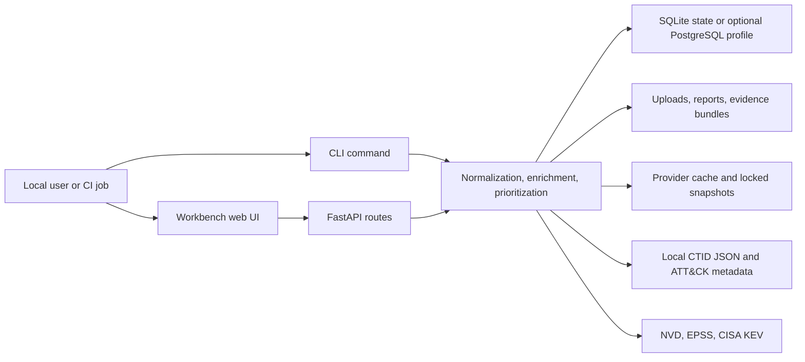

# Workbench Threat Model and Readiness

Status: current local-first Workbench threat model. Last reviewed: 2026-04-25.

This page defines the defensive threat model and operational readiness assumptions for the local Workbench. It keeps the same product boundaries as the rest of the project: `vuln-prioritizer` prioritizes known CVEs and existing findings. It is not a scanner, exploit tool, proof-of-concept generator, or general-purpose vulnerability-management platform.

## Scope

The current local-first Workbench threat model covers:

- local CLI use and the self-hosted FastAPI/Jinja2 Workbench
- import of existing CVE lists and selected scanner export files
- provider enrichment from NVD, FIRST EPSS, CISA KEV, local caches, and locked provider snapshots
- optional ATT&CK context from local CTID Mappings Explorer JSON and local technique metadata
- SQLite-backed single-node Workbench state by default
- optional single-node PostgreSQL profile for migration and deployment smoke checks
- local-first API token bootstrap for mutating `/api/*` routes
- generated JSON, Markdown, HTML, CSV, SARIF, and evidence bundle artifacts

The current local-first Workbench threat model does not cover:

- active network, host, container, cloud, or source-code scanning
- exploitation, payload generation, exploit verification, or PoC handling
- internet-exposed multi-tenant hosting
- SSO, ticketing write-back integrations, background workers, or managed database operations
- heuristic, fuzzy, or LLM-generated CVE-to-ATT&CK mapping

## Assets

| Asset | Security objective | Notes |
| --- | --- | --- |
| Imported finding files | Confidentiality, integrity, provenance | Inputs may contain hostnames, package paths, image names, service names, owners, or environment labels. |
| Normalized findings and run records | Integrity, reproducibility | The Workbench preserves source provenance and does not silently rewrite evidence. |
| Provider enrichment data | Integrity, freshness transparency | NVD, EPSS, KEV, local cache, and locked snapshot data must remain distinguishable in outputs. |
| ATT&CK mapping data | Integrity, source provenance | `ctid-json` is canonical for Workbench ATT&CK mappings. Technique metadata may enrich labels but must not create mappings. |
| Asset context, VEX, and waivers | Integrity, auditability | These records influence explanation, applicability, or suppression and need explicit rationale. |
| SQLite database | Integrity, local confidentiality, availability | Default persistence is a local single-node SQLite file or Compose volume. |
| Optional PostgreSQL database | Integrity, local confidentiality, availability | The Compose `postgres` profile exercises the same Workbench schema on a private single-node database. Credentials, volumes, backups, network exposure, and retention are operator responsibilities. |
| Upload, report, and evidence directories | Confidentiality, integrity, availability | Generated artifacts may include source metadata and should be treated as security-sensitive. |
| Configuration and secrets | Confidentiality | Environment values such as NVD keys and CSRF tokens must not be displayed in full or written into reports. |
| Web session, CSRF token, and API tokens | Integrity, confidentiality | The local web UI must reject unintended form submissions and unsafe state changes. API tokens gate mutating API requests after the first active token exists, and only token hashes should be stored. |
| Documentation and examples | Integrity | Examples should remain defensive and avoid exploit details. |

## Trust Boundaries

Primary boundaries:

- User or CI input to CLI/API: all uploaded files, paths, flags, and form fields are untrusted until validated.
- Web UI to API handlers: browser requests need CSRF protection, size limits, method checks, and server-side validation.
- API/CLI to filesystem: file reads and writes must stay inside configured upload, report, provider snapshot, and cache directories unless the CLI user explicitly supplies a path.
- API/CLI to database: application code must use structured database access and must not expose raw SQL or table internals as a public contract.
- Provider cache or snapshot to prioritization: cached and locked data must carry provenance so stale or replayed data is visible.
- ATT&CK source files to reports: CTID JSON mappings are trusted only as local evidence-backed context, not proof of exploitation.
- Local Workbench to external providers: live provider calls are optional enrichment paths and must not be required for locked offline replay.

## Threats and Mitigations

| Threat | Impact | Mitigations and readiness expectation |
| --- | --- | --- |
| Malicious or malformed import file | Parser failure, resource exhaustion, misleading findings | Enforce input-format validation, upload size limits, structured parsers, safe XML parsing, and clear parse warnings. Do not execute content from imports. |
| Path traversal in uploads, snapshots, or report downloads | Unauthorized local file read/write | Resolve configured directories server-side, reject arbitrary snapshot paths in Workbench forms, generate server-owned artifact names, and avoid reflecting user-supplied paths into downloads. |
| Cross-site request forgery against local Workbench forms | Unauthorized imports, report generation, or state changes | Require CSRF token validation for state-changing web forms and keep the token local to the process or configured environment. |
| Stored or reflected HTML/script from imported metadata | Browser compromise, misleading reports | Escape all user-controlled values in Jinja2 templates and generated HTML. Treat scanner fields, asset names, owners, paths, and descriptions as untrusted text. |
| Provider data tampering or stale cache use | Incorrect prioritization or misleading evidence | Show provider source, cache status, timestamps, checksums where available, and locked snapshot provenance. Keep offline replay explicit. |
| ATT&CK mapping drift or speculative mappings | Misleading threat context | Use `ctid-json` as canonical for Workbench mappings, preserve source checksum/provenance, leave absent CVEs unmapped, and reject heuristic, fuzzy, or LLM-generated mappings as source of record. |
| Confusing ATT&CK context with exploit proof | Overstated risk or unsafe operational decisions | Label ATT&CK as defensive context. Do not include exploit instructions, payloads, PoC steps, or claims that a mapping proves active exploitation. |
| Hidden scoring changes from context layers | Loss of trust in priority decisions | Keep base priority transparent from CVSS, EPSS, and KEV. Present ATT&CK, asset context, VEX, and waivers as separate rationale or applicability layers. |
| SQLite corruption or single-node contention | Lost run history or failed imports | Document SQLite as default single-node storage, keep writes short, use migrations, and treat database backup/restore as an operator responsibility. |
| Optional PostgreSQL profile misconfiguration | Unauthorized database access, persistent data exposure, or unavailable Workbench state | Keep the Compose profile bound to local/private use, avoid committing real credentials, prefer secret injection outside committed files, restrict database network reachability, use migrations consistently, and treat backups, retention, TLS, and role hardening as operator controls beyond the smoke profile. |
| API token bootstrap misuse | Unauthorized state changes through local API routes | Keep token behavior local-first: a fresh local database has no active tokens for offline demos, the first token is created through `POST /api/tokens`, and mutating `/api/*` routes require `Authorization: Bearer <token>` or `X-API-Token: <token>` after any active token exists. Store only SHA-256 token hashes, update last-used metadata, and do not render token values again after creation. |
| Secret exposure in UI, logs, reports, or evidence bundles | Credential leakage | Redact API keys and token values, avoid printing full environment contents, and exclude secrets from generated reports and evidence manifests. |
| Oversized reports or evidence bundles | Disk exhaustion, slow UI, failed downloads | Enforce upload limits, keep generated artifacts in configured report directories, document cleanup responsibility, and surface generation errors. |
| Supply-chain or dependency compromise | Compromised runtime or generated artifacts | Prefer pinned release installs, local checks, virtual environments, and reproducible docs/build commands. Do not load remote code through ATT&CK metadata or provider data. |
| Internet-exposed Workbench deployment | Unauthorized access to imports, reports, and local state | Treat the current Workbench as local-first and not hardened for public exposure. API tokens are a local automation guard, not a complete internet-facing authentication, authorization, TLS, session, or multi-user isolation model. |

## Operational Assumptions

- The operator runs the Workbench on a trusted workstation, local VM, CI runner, or private single-node host.
- The default database is SQLite. The optional Postgres Compose profile is for private single-node smoke testing or operator-managed deployments; clustered deployments, background workers, and multi-tenant state separation are not part of the current local-first scope.
- The Workbench is not exposed directly to the public internet.
- The operator controls local filesystem permissions for the SQLite database, uploads, reports, provider cache, and evidence bundles. For Postgres, the operator controls credentials, database network reachability, volumes, backups, and retention.
- Imported files are treated as sensitive security data and are not committed unless they are sanitized fixtures.
- Live provider calls may fail or be rate-limited. Locked provider snapshots and local caches are expected paths for reproducible demos and audits.
- ATT&CK context is optional. Missing CTID files or unmapped CVEs must not block base CVE prioritization.
- Evidence bundles are integrity artifacts, not encrypted archives. Operators are responsible for secure storage and transfer.
- API tokens are local bootstrap credentials for automation and mutating API requests. They are not an SSO, RBAC, or multi-user session model.
- Documentation examples remain defensive. They should not include exploit code, payloads, PoC links as instructions, or active exploitation workflows.

## Readiness Checklist

The current local-first Workbench is readiness-aligned when:

- scope text in README, architecture docs, and Workbench docs consistently says known-CVE prioritizer, not scanner
- Workbench runtime docs identify SQLite as the default single-node persistence model and the Postgres profile as optional/private
- imports have size limits, format validation, and parser warnings
- locked provider snapshot replay is explicit and path-restricted
- reports and evidence bundles include provider provenance and do not leak configured secrets
- web forms use CSRF protection for state-changing operations
- API token docs describe the local-first bootstrap behavior, token hash storage, supported headers, and the limit that tokens are not an internet-facing auth model
- generated HTML escapes imported metadata and local context fields
- ATT&CK docs and UI copy identify `ctid-json` as canonical and local CSV as legacy compatibility only
- ATT&CK unmapped states are explicit and no heuristic or LLM-generated mappings are promoted
- base priority remains explainable from CVSS, EPSS, and KEV, with context layers shown separately
- operator docs state that internet exposure, multi-tenancy, SSO, RBAC, background workers, and ticket write-back are out of v1.2 scope

## Control Evidence for v1.2

| Control | Code evidence | Test or smoke evidence |
| --- | --- | --- |
| Security headers | `src/vuln_prioritizer/api/app.py` installs `_security_headers` for `X-Content-Type-Options`, `X-Frame-Options`, `Referrer-Policy`, `Cross-Origin-Opener-Policy`, `Permissions-Policy`, and a restrictive CSP. | `tests/api/test_workbench_api.py::test_workbench_health_and_project_crud` asserts `nosniff`, `DENY`, and `object-src 'none'` on `/api/health`. |
| Upload filename and path validation | `src/vuln_prioritizer/api/routes.py` rejects unsafe upload filenames, sanitizes stored names, restricts extensions per Workbench input/context type, stores uploads under UUID-owned directories, and restricts provider/ATT&CK artifact names to configured roots. | `tests/api/test_workbench_api.py::test_workbench_rejects_unsupported_and_oversized_uploads` covers traversal filenames and oversized uploads; `test_workbench_rejects_untrusted_provider_snapshot_path` covers snapshot path rejection. |
| Report and evidence artifact downloads | `src/vuln_prioritizer/services/workbench_reports.py` writes run artifacts under the configured report directory; `src/vuln_prioritizer/api/routes.py` resolves downloads back under that root, verifies SHA-256, returns attachment downloads, and disables caching. | `tests/api/test_workbench_api.py::test_workbench_import_findings_reports_and_evidence` verifies JSON, Markdown, HTML, CSV, SARIF, evidence ZIP, manifest hashes, and verification URLs; `test_workbench_downloads_reject_tampered_artifact_paths` covers outside-root and checksum-tamper rejection. |
| CSV report formula handling | `src/vuln_prioritizer/services/workbench_reports.py` prefixes formula-like CSV cells before writing Workbench findings reports. | `tests/api/test_workbench_api.py::test_workbench_csv_report_escapes_spreadsheet_formulas` covers component, owner, and service cells that begin with spreadsheet formula characters. |
| API token bootstrap | `src/vuln_prioritizer/api/routes.py` creates one-time token values and stores SHA-256 hashes; `src/vuln_prioritizer/api/app.py` gates mutating `/api/*` requests once any active token exists and accepts `Authorization: Bearer` or `X-API-Token`. | `tests/api/test_workbench_api.py::test_workbench_api_tokens_config_provider_jobs_and_github_preview` verifies hash storage, blocked unauthenticated mutations after token creation, bad-token rejection, accepted token use, and `last_used_at` updates. |
| Optional Postgres profile | `docker-compose.yml` keeps the default Workbench service on SQLite and adds `postgres` plus `workbench-postgres` under the `postgres` profile with a private `127.0.0.1:8001` bind. | `tests/test_workbench_integration_contracts.py::test_compose_keeps_sqlite_default_and_adds_postgres_profile` checks the profile contract; `make docker-postgres-migration-smoke` exercises the profile and Alembic path when Docker is available. |
| 10k findings API smoke | `src/vuln_prioritizer/api/routes.py` exposes paginated findings with limit/offset and sort controls. This is a smoke check, not the final scale architecture. | `tests/api/test_workbench_api.py::test_workbench_findings_api_handles_10k_pagination_smoke` seeds 10,000 findings and verifies a high-offset page. |
| Docker demo smoke | `docker compose up --build` is the supported local Workbench demo path. | `make docker-demo-smoke` starts Compose, polls `http://127.0.0.1:8000/api/health`, and tears the stack down with `docker compose down -v --remove-orphans`. |
| Dependency audit | Project dependencies are reviewed from `requirements.txt`, not the caller's incidental global environment. | `make dependency-audit` requires `pip-audit` and runs `python3 -m pip_audit --requirement requirements.txt`; release notes or the release checklist should record the result and any accepted exceptions. |

## Smoke and Audit Evidence

Maintain v1.2 readiness with local, repeatable checks:

- `make check` for formatting, linting, typing, and the Python test suite.
- `make workflow-check` before merge or release branches when Docker and pre-commit tooling are available.
- `make docker-demo-smoke` for the Compose quickstart path; it starts the Workbench, polls `/api/health`, and removes the demo stack.
- `make docker-postgres-migration-smoke` for the optional Postgres profile when Docker is available.
- `make demo-sync-check-temp` before release when output changes affect checked-in examples, reports, SARIF, HTML, or evidence artifacts.
- `make dependency-audit` for maintainer dependency review when `pip-audit` is installed and advisory data is reachable.

Dependency audit results, accepted exceptions, and Docker smoke evidence should be recorded in release notes or the release checklist for the milestone being shipped. Tests and demos must stay fixture-based and must not depend on live provider availability.

## Residual Risk

The v1.2 Workbench intentionally accepts some local-tooling risk in exchange for a small, auditable deployment model. A local attacker with filesystem or database access can read or modify SQLite or Postgres data, uploads, reports, caches, and evidence bundles. A user with access to the local web UI can view imported security data and generate artifacts. A user with a valid local API token can make mutating API requests while that token remains active. These risks are acceptable only under the local-first, trusted-operator assumption.

Before the Workbench is positioned for shared or exposed deployments, the project should add an updated threat model covering authentication, authorization, session management, TLS termination, per-user/project isolation, audit logs, background job isolation, database hardening, retention controls, and operational monitoring.
