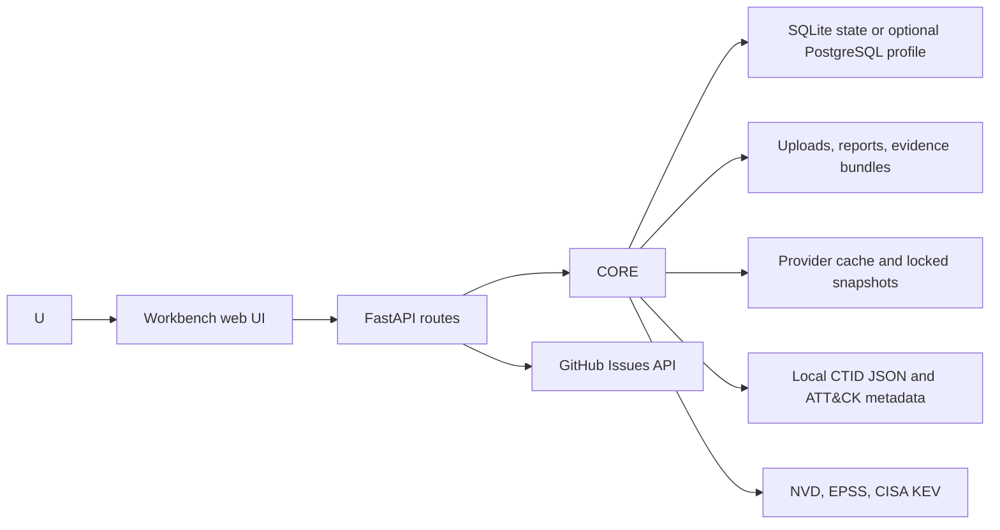

# Workbench Threat Model and Readiness

Status: current local-first Workbench threat model. Last reviewed: 2026-05-12.

This page defines the defensive threat model and operational readiness assumptions for the local Workbench. It keeps the same product boundaries as the rest of the project: `vuln-prioritizer` prioritizes known CVEs and existing findings. It is not a scanner, exploit tool, proof-of-concept generator, or general-purpose vulnerability-management platform.

## Scope

The current local-first Workbench threat model covers:

- active browser Workbench use through the backend runtime in `backend/app` and
  the React frontend
- retained shared domain logic under `backend/src/vuln_prioritizer/**`
- import of existing CVE lists and selected scanner export files
- provider enrichment from NVD, FIRST EPSS, CISA KEV, local caches, and locked provider snapshots
- optional ATT&CK context from local CTID Mappings Explorer JSON and local technique metadata
- database-backed single-node Workbench state through SQLite in local developer
  runs or PostgreSQL in the Compose quickstart
- local single-user browser/API access for active `/api/v1` routes, without
  login, RBAC, session cookies, API tokens, or CSRF headers
- local-first GitHub issue preview/export
- generated JSON, Markdown, HTML, CSV, SARIF, and evidence bundle artifacts

The current local-first Workbench threat model does not cover:

- active network, host, container, cloud, or source-code scanning
- exploitation, payload generation, exploit verification, public PoC workflows,
  exploit-instruction handling, or offensive attack-chain guidance
- internet-exposed multi-tenant hosting
- SSO, organization-wide ticket sync policy, background workers, or managed database operations
- heuristic, fuzzy, or LLM-generated CVE-to-ATT&CK mapping

## Assets

| Asset | Security objective | Notes |
| --- | --- | --- |
| Imported finding files | Confidentiality, integrity, provenance | Inputs may contain hostnames, package paths, image names, service names, owners, or environment labels. |
| Normalized findings and run records | Integrity, reproducibility | The Workbench preserves source provenance and does not silently rewrite evidence. |
| Provider enrichment data | Integrity, freshness transparency | NVD, EPSS, KEV, local cache, and locked snapshot data must remain distinguishable in outputs. |
| ATT&CK mapping data | Integrity, source provenance | `ctid-json` is canonical for Workbench ATT&CK mappings. Technique metadata may enrich labels but must not create mappings. |
| Asset context, VEX, and waivers | Integrity, auditability | These records influence explanation, applicability, or suppression and need explicit rationale. |
| Workbench database | Integrity, local confidentiality, availability | Local developer runs may use SQLite; the Compose quickstart uses PostgreSQL for the active `backend/app` schema. Credentials, volumes, backups, network exposure, and retention are operator responsibilities. |
| Upload, report, and evidence directories | Confidentiality, integrity, availability | Generated artifacts may include source metadata and should be treated as security-sensitive. |
| Configuration and secrets | Confidentiality | Environment values such as NVD keys, provider credentials, and deployment secrets must not be displayed in full or written into reports. Secret-bearing settings should store names, state, or hashes rather than values whenever possible. |
| Provider endpoint configuration | Integrity, least privilege | Built-in NVD, FIRST EPSS, and CISA KEV live endpoints are fixed HTTPS public-source constants. Runtime configuration may choose cache, snapshot, or offline-file inputs but must not accept unsafe live provider URL overrides. |
| Local browser/API access | Integrity, confidentiality | The active Workbench is single-user and does not require login, session cookies, RBAC, project membership, API tokens, or CSRF headers. Bearer headers are ignored by the local principal path. |
| GitHub issue export tokens | Confidentiality, least privilege | The implemented GitHub issue export reads a bearer token from an explicit environment variable name such as `GITHUB_TOKEN`; token values must not be stored in the Workbench database, reports, evidence bundles, or audit metadata. |
| GitHub issue preview/export records | Integrity, auditability | Preview payloads, duplicate keys, created issue URLs, and issue numbers support local review and duplicate avoidance without making external ticket systems part of base prioritization. |
| Documentation and examples | Integrity | Examples should remain defensive and avoid exploit details. |

## Trust Boundaries

```mermaid
flowchart LR
  U --> WEB["Workbench web UI"]
  WEB --> API["FastAPI routes"]
  API --> CORE
  CORE --> DB["SQLite state or optional PostgreSQL profile"]
  CORE --> FS["Uploads, reports, evidence bundles"]
  CORE --> CACHE["Provider cache and locked snapshots"]
  CORE --> ATK["Local CTID JSON and ATT&CK metadata"]
  CORE --> LIVE["NVD, EPSS, CISA KEV"]
  API --> TICKETS["GitHub Issues API"]
```

Primary boundaries:

- User input to the Workbench API: all uploaded files, paths, and form fields are
  untrusted until validated.
- Web UI to API handlers: browser requests need size limits, method checks, and
  server-side validation. If a deployment enables browser session auth again,
  CSRF protection is part of that reviewed boundary.
- Workbench API to filesystem: file reads and writes must stay inside configured upload, report, provider snapshot, and cache directories.
- Workbench API to database: application code must use structured database access and must not expose raw SQL or table internals as a public contract.
- Provider cache or snapshot to prioritization: cached and locked data must carry provenance so stale or replayed data is visible.
- ATT&CK source files to reports: CTID JSON mappings are trusted only as local evidence-backed context, not proof of exploitation.
- Local Workbench to external providers: live provider calls are optional enrichment paths and must not be required for locked offline replay. Built-in provider calls use fixed HTTPS public-source endpoints rather than operator-supplied runtime URLs.
- Local Workbench to GitHub Issues: preview is local-only; create/export calls may
  call the fixed GitHub API host only when a trusted local operator supplies an
  `owner/name` repository and an explicit token environment variable name.

## Threats and Mitigations

| Threat | Impact | Mitigations and readiness expectation |
| --- | --- | --- |
| Malicious or malformed import file | Parser failure, resource exhaustion, misleading findings | Enforce input-format validation, upload size limits, suffix/MIME allowlists, structured parsers, safe XML parsing, path-redacted parser errors, and clear parse warnings. Do not execute content from imports. |
| Path traversal in uploads, snapshots, or report downloads | Unauthorized local file read/write | Resolve configured directories server-side, reject arbitrary snapshot paths in Workbench forms, generate server-owned artifact names, and avoid reflecting user-supplied paths into downloads. |
| Cross-site request forgery or confused browser session | Unauthorized imports, report generation, or state changes | The active local browser UI does not depend on a login session. Keep same-origin browser defaults, validate every mutating request server-side, and treat any reintroduced browser-session auth as a reviewed deployment boundary with CSRF coverage. |
| Stored or reflected HTML/script from imported metadata | Browser compromise, misleading reports | Escape all user-controlled values in React text nodes and generated HTML. Treat scanner fields, asset names, component names, owners, paths, provider metadata, and descriptions as untrusted text. Keep Workbench API and production frontend responses on the local-first security-header baseline with CSP, frame blocking, `nosniff`, and referrer restrictions. |
| Provider data tampering or stale cache use | Incorrect prioritization or misleading evidence | Show provider source, cache status, timestamps, checksums where available, and locked snapshot provenance. Keep offline replay explicit. |
| ATT&CK mapping drift or speculative mappings | Misleading threat context | Use `ctid-json` as canonical for Workbench mappings, preserve source checksum/provenance, leave absent CVEs unmapped, and reject heuristic, fuzzy, or LLM-generated mappings as source of record. |
| Confusing ATT&CK context with exploit proof | Overstated risk or unsafe operational decisions | Label ATT&CK as defensive context. Do not include exploit instructions, payloads, PoC steps, or claims that a mapping proves active exploitation. |
| Hidden scoring changes from context layers | Loss of trust in priority decisions | Keep base priority transparent from CVSS, EPSS, and KEV. Present ATT&CK, asset context, VEX, and waivers as separate rationale or applicability layers. |
| SQLite corruption or single-node contention | Lost run history or failed imports | Document SQLite as default single-node storage, keep writes short, use migrations, and treat database backup/restore as an operator responsibility. |
| PostgreSQL misconfiguration | Unauthorized database access, persistent data exposure, or unavailable Workbench state | Keep the Compose database bound to local/private use, avoid committing real credentials, prefer secret injection outside committed files, restrict database network reachability, use migrations consistently, and treat backups, retention, TLS, and role hardening as operator controls. |
| Accidental local API exposure | Unauthorized state changes through local API routes | Active `/api/v1` routes run through `backend/app` with a local single-user principal. Keep the service bound to trusted local or private hosts, validate `ALLOWED_HOSTS`, keep docs disabled outside local development, and treat browser login, API tokens, or shared-user access as future reviewed security work rather than current protection. |
| Unsafe secret source or environment-variable name | Credential leakage or accidental literal-token use | Read the NVD API key only from the variable name configured by `VULN_PRIORITIZER_NVD_API_KEY_ENV`, defaulting to `NVD_API_KEY`. Environment-variable name settings must match `^[A-Z_][A-Z0-9_]*$` and must never be interpreted as raw secret values. |
| Bootstrap default secrets used outside local/dev | Predictable signing keys or local runtime secrets in shared environments | Treat defaults such as `changethis` as local/dev bootstrap placeholders only. Staging and production must reject default `SECRET_KEY` and equivalent secret values before serving traffic. Unknown `ENVIRONMENT` values fail closed instead of silently selecting local mode. Local mode may use the placeholders only with local-only `ALLOWED_HOSTS`; public hostnames require real secrets even if `ENVIRONMENT=local`. |
| Untrusted Host headers or accidental public routing | Host-header confusion, cache poisoning, or unintended exposure of a local-first service | Active `backend/app` deployments must configure `ALLOWED_HOSTS` for the exact local, TestClient, container, or operator hostnames that may reach the API. Defaults allow only local/demo hosts. Public or shared deployments must set `ALLOWED_HOSTS` to the expected domain names and use non-default secrets. Catch-all `*` host validation is rejected; wildcard entries must be scoped domain suffixes such as `*.example.com`. |
| Public OpenAPI or interactive API docs in shared environments | API surface discovery or generated-client metadata exposed beyond local operators | OpenAPI and interactive docs are exposed by default only for local development and generated-client workflows. Staging or production deployments should leave `API_DOCS_ENABLED` unset or false unless the docs route is intentionally published behind the reviewed deployment boundary. |
| Traefik dashboard exposed by default | Administrative proxy metadata or controls reachable from an unintended network | The Compose Traefik dashboard router is disabled unless `TRAEFIK_DASHBOARD_ENABLED=true`. If enabled, keep `TRAEFIK_DASHBOARD_IP_ALLOWLIST` narrowed to the operator network or add an equivalent authenticated dashboard middleware before shared use. |
| Secret exposure in UI, logs, reports, or evidence bundles | Credential leakage | Redact API keys and token values, avoid printing full environment contents, and exclude secrets and local absolute paths from generated reports and evidence manifests. Settings, reports, and log-facing diagnostics should expose only `<set>`, `<not set>`, variable names, counts, hashes, bundle paths, or source labels. |
| Runtime provider URL override | Provider data tampering, SSRF-style reachability, or non-public-source enrichment | Keep NVD, FIRST EPSS, and CISA KEV provider URLs as fixed HTTPS constants for public sources. Do not add environment variables, request fields, or project settings that override live provider endpoints. Offline fixtures and locked snapshots remain explicit local artifacts, not endpoint substitutes. |
| GitHub issue export posts sensitive finding metadata to the wrong destination | Exposure of CVEs, assets, owners, paths, or remediation detail in an external system | Keep GitHub issue export local-first and operator-initiated. Export posts only to the fixed GitHub API host after `repository: "owner/name"` validation, defaults export requests to `dry_run: true`, and reads credentials only from an explicit token environment-variable name. Jira and ServiceNow export flows are not implemented; adding them requires a separate implementation, tests, allowlist design, and threat-model update. |
| Duplicate or repeated GitHub issue creation | Alert fatigue, duplicate remediation work, or noisy external audit trails | Generate deterministic duplicate keys, persist completed GitHub issue duplicate keys locally, skip duplicates on repeated exports, and remove failed empty reservations so retries are not blocked by incomplete local rows. |
| GitHub issue export token misuse or over-privileged credentials | Unauthorized issue creation or broader external account compromise | Read tokens only at request time from explicit environment variables such as `GITHUB_TOKEN`, use narrowly scoped external tokens, do not store token values in the Workbench database, and include only counts and non-secret metadata in audit events. |
| Oversized reports or evidence bundles | Disk exhaustion, slow UI, failed downloads | Enforce upload and generated-report size limits, retain only a bounded number of report artifacts per analysis run, keep generated artifacts in configured report directories, and surface generation errors. |
| Supply-chain or dependency compromise | Compromised runtime or generated artifacts | Prefer pinned release installs, local checks, virtual environments, and reproducible docs/build commands. Do not load remote code through ATT&CK metadata or provider data. |
| Internet-exposed Workbench deployment | Unauthorized access to imports, reports, and local state | Treat the current Workbench as local-first. The VPW-AUD-999 scorecard closed on 2026-05-08, but public or shared exposure still needs fresh candidate-specific deployment evidence. Local single-user access does not certify internet-facing authentication, authorization, TLS, or shared-operation posture. |

## Operational Assumptions

- The operator runs the Workbench on a trusted workstation, local VM, CI runner, or private single-node host.
- The default developer database can be SQLite. The Compose quickstart uses a
  private single-node PostgreSQL service; clustered deployments, background
  workers, and multi-tenant state separation are not part of the current
  local-first scope.
- The Workbench is not exposed directly to the public internet.
- Project access is simplified for the local single-user browser workflow.
  Multi-user project membership and project-admin RBAC are outside the current
  local-first scope.
- The operator controls local filesystem permissions for the SQLite database, uploads, reports, provider cache, and evidence bundles. For Postgres, the operator controls credentials, database network reachability, volumes, backups, and retention.
- Imported files are treated as sensitive security data and are not committed unless they are sanitized fixtures.
- Live provider calls may fail or be rate-limited. Locked provider snapshots and local caches are expected paths for reproducible demos and audits.
- Live provider endpoints are fixed HTTPS public-source constants for NVD, FIRST EPSS, and CISA KEV. Operators can select locked snapshots, caches, and offline files for deterministic replay, but not arbitrary provider URLs.
- ATT&CK context is optional. Missing CTID files or unmapped CVEs must not block base CVE prioritization.
- Evidence bundles are integrity artifacts, not encrypted archives. Operators are responsible for secure storage and transfer.
- The active API-token, login, user-management, and session-list surfaces are
  disabled. The current migration head drops the inactive API-token and
  auth-session tables, so they are not an active automation, persistence, or
  browser-login model.
- NVD, GitHub issue export, and other implemented token-bearing integrations use
  explicit environment variable names that match `^[A-Z_][A-Z0-9_]*$`; token
  values stay outside committed config and generated evidence.
- GitHub issue preview/export is an optional local automation bridge. Preview
  does not call GitHub; create/export calls are operator-triggered, default to
  dry-run behavior, and require an explicit `owner/name` repository plus a token
  environment variable name.
- Jira and ServiceNow export flows are future integrations, not active
  Workbench support. They need a shipped implementation, tests, operator docs,
  and a threat-model update before they can be described as supported.
- Documentation examples remain defensive. They should not include exploit code, payloads, PoC links as instructions, or active exploitation workflows.

## Shared Deployment Prerequisites

The current supported posture is local/private single-operator use.
Public-production readiness is not certified by this page alone. The VPW-AUD-999
scorecard closed on 2026-05-08, with supporting evidence tracked in
[Public-Production Release Evidence Ledger](./public-production-release-evidence-ledger.md).
The controls below remain candidate-specific prerequisites and evidence targets,
not a blanket production-readiness claim.

Shared or internet-exposed Workbench deployment is only acceptable after the
public-deployment controls in
[Local And Private Workbench Deployment Runbook](./workbench-public-deployment.md) are
configured and verified. The current implementation provides baseline controls
for local single-user operation, audit events, retention cleanup, strict CORS
validation, migration readiness, and
backup/restore runbooks. Before positioning the Workbench as a broader SaaS or
multi-tenant service, the project still needs a new reviewed threat-model
version and these controls as product requirements:

- authentication stronger than local bootstrap defaults that covers browser sessions, automation, token rotation, and recovery
- explicit `ALLOWED_HOSTS`, non-default `SECRET_KEY`, and disabled or access-controlled `API_DOCS_ENABLED`
- disabled Traefik dashboard routing, or dashboard routing protected by a narrow IP allowlist or authentication middleware
- authorization rules for project-level access, mutable actions, token administration, reports, evidence bundles, and provider jobs
- project isolation rules for database queries, filesystem artifacts, uploads, provider snapshots, report downloads, evidence bundles, and cleanup tasks
- TLS termination and reverse-proxy guidance, including trusted host configuration, secure cookies, forwarded headers, request-size limits, and log redaction
- audit retention policy for imports, lifecycle changes, waivers, reports, evidence bundles, tokens, provider jobs, GitHub exports, and detection-control changes
- backup and restore procedures for the database, uploads, provider cache, reports, evidence bundles, and configuration snapshots
- retention ownership and disk-usage limits per project so cleanup cannot remove artifacts from another project or hide required audit evidence
- operational monitoring for job failures, stale provider data, failed migrations, artifact-integrity failures, and storage pressure
- documented incident response for exposed reports, tampered evidence bundles, and compromised provider snapshot directories

These prerequisites are intentionally listed as blockers rather than implied
support. Local single-user access is not a complete shared-deployment auth
model unless candidate-specific evidence explicitly accepts that boundary.

## Readiness Checklist

The current local-first Workbench is readiness-aligned when:

- scope text in README, architecture docs, and Workbench docs consistently says known-CVE prioritizer, not scanner
- Workbench runtime docs identify the active `backend/app` database boundary and
  the local/private Compose database assumptions
- imports have size limits, suffix/MIME allowlists, traversal-safe filenames,
  project/run isolation, path-redacted parser errors, safe XML handling, and
  parser warnings
- locked provider snapshot replay is explicit and path-restricted
- reports and evidence bundles include provider provenance and do not leak configured secrets
- NVD API key configuration stores only an environment variable name, defaults to `NVD_API_KEY`, validates names with `^[A-Z_][A-Z0-9_]*$`, and redacts any resolved value from settings, reports, and log-facing diagnostics
- bootstrap default secrets are accepted only for local/dev bootstrap and are rejected for staging and production; production/staging also require `SECRET_KEY` length >= 32
- live NVD, FIRST EPSS, and CISA KEV provider URLs are fixed HTTPS public-source constants with no unsafe runtime override path
- docs and generated clients show that `/api/v1/login/*`, `/api/v1/users/*`,
  `/api/v1/api-tokens/*`, and `/api/v1/audit/sessions` are not active local
  runtime contracts
- generated HTML escapes imported metadata and local context fields
- Workbench API responses and production frontend static responses include the
  local-first security-header baseline with CSP, `nosniff`, frame blocking,
  referrer restrictions, COOP, and Permissions Policy
- ATT&CK docs and UI copy identify `ctid-json` as canonical and local CSV as legacy compatibility only
- ATT&CK unmapped states are explicit and no heuristic or LLM-generated mappings are promoted
- base priority remains explainable from CVSS, EPSS, and KEV, with context layers shown separately
- GitHub issue export stays operator-triggered, defaults to dry-run, uses an
  explicit `token_env` name, and persists duplicate keys for idempotency without
  storing token values
- operator docs state that internet exposure, multi-tenancy, SSO, background
  workers, and organization-wide ticket sync policy are out of v1.2 scope

## Control Evidence for v1.2

| Control | Code evidence | Test or smoke evidence |
| --- | --- | --- |
| Security headers and safe HTML rendering | Active runtime code in `backend/app/main.py` installs security-header middleware for `X-Content-Type-Options`, `X-Frame-Options`, `Referrer-Policy`, `Cross-Origin-Opener-Policy`, `Permissions-Policy`, and a restrictive CSP. `frontend/nginx.conf` serves the production React bundle with the same baseline and same-origin `connect-src 'self'`; browser API calls go through `/api/...` unless a split-domain deployment explicitly revises CSP/CORS controls. `backend/app/services/reports.py` escapes generated executive HTML report fields with `_safe_html`. VPW-070 evidence is archived in `archive/vpw-evidence/vpw-070-html-security-xss.md`. | `backend/tests/api/test_workbench_local_runtime_smoke.py`, `backend/tests/api/test_workbench_reports_api.py::test_vpw070_html_report_escapes_malicious_external_text`, `backend/tests/test_workbench_integration_contracts.py`, and `make docker-production-smoke` cover header and escaping regressions. |
| Import upload hardening | Active FastAPI imports in `backend/app/api/routes/imports.py` and asset-context imports in `backend/app/api/routes/assets.py` are size bounded, suffix/MIME allowlisted, traversal-safe, and isolated under configured upload roots by project/run. Parser errors returned to clients are path-redacted. Nessus/OpenVAS XML handling uses defused XML handling and rejects DOCTYPE, ENTITY, and XXE-style constructs before parsing. VPW-069 evidence is archived in `archive/vpw-evidence/vpw-069-upload-security-hardening.md`. | `backend/tests/api/test_workbench_import_upload_api.py`, XML input-loader contract tests, `make check`, `make dependency-audit`, and `make docker-demo-smoke` passed for VPW-069. |
| Report and evidence artifact downloads | `backend/app/services/reports.py`, `backend/app/services/report_renderers.py`, and related report services write run artifacts under the configured report directory. Active report routes resolve downloads back under that root, verify stored artifacts, return attachment downloads, and verify evidence bundles without extracting unsafe members. | `backend/tests/api/test_workbench_reports_api.py` verifies JSON, Markdown, HTML, CSV, SARIF, evidence ZIP, manifest hashes, verification URLs, outside-root rejection, checksum handling, and formula-safe CSV output. |
| Single-user active access model | Workbench dependencies in `backend/app/api/deps.py` resolve an in-memory local actor and do not require login, RBAC, project membership, API tokens, session cookies, or CSRF headers. Login, user-management, API-token, and session-list routers are not mounted in `backend/app/api/main.py`; the current migration head also drops the inactive user, API-token, and auth-session tables. | `backend/tests/api/test_workbench_local_runtime_smoke.py`, `backend/tests/api/test_workbench_local_access.py`, and generated-client drift checks verify that removed auth/token/user routes are not active contracts. `backend/tests/test_backend_runtime_boundary.py` verifies the active import graph does not reach removed runtime modules. |
| Compose database and provider refresh | `compose.yml` starts the active backend and frontend by default, gives the backend writable provider snapshot/cache volumes, and does not define a second Workbench runtime. | `tests/test_workbench_integration_contracts.py` checks the active Compose boundary; `make docker-demo-smoke` verifies the Compose Postgres Alembic head/model schema, a direct repository create/list/delete path, and the active import plus provider update path when Docker is available. |
| 10k findings API smoke | The active API exposes paginated findings with limit/offset and sort controls. This is a smoke check, not the final scale architecture. | `make performance-smoke` runs the VPW-072 import and pagination smoke with 10,000 findings. |
| Docker demo smoke | `docker compose -f compose.yml -f compose.override.yml up --build backend frontend` is the supported active Workbench readiness path. Direct Compose defaults remain `8000` for the backend and `5173` for the frontend; `make docker-demo-smoke` defaults to isolated host ports `18080` and `15174` so release checks do not collide with a manual quickstart. `DOCKER_DEMO_BACKEND_PORT` and `DOCKER_DEMO_FRONTEND_PORT` may override only local host bindings. | `make docker-demo-smoke` starts Compose, polls `/api/v1/utils/health-check/` on the configured host backend port, verifies the Compose Postgres Alembic head/model schema plus a direct repository create/list/delete path, runs a local import/provider smoke, and tears the stack down with `docker compose down -v --remove-orphans`. |
| Production-like Docker smoke | `compose.production-smoke.yml` overlays production environment flags, non-default secrets, same-origin frontend API routing, docs-disabled backend behavior, and exact hosts. | `make docker-production-smoke` validates the Compose Postgres Alembic head/model schema plus repository write path, CSP, minimal public health, local readiness and provider diagnostics, import, report download, and path-redacted JSON responses. |
| Dependency audit | Backend dependency policy stays bounded in `backend/requirements.txt`, Python resolution is committed in `uv.lock`, backend audit uses the exported hash-pinned `backend/requirements.lock.txt`, Docker runtime installs use the separate Python 3.12 `backend/requirements.runtime.lock.txt` without dev extras, and frontend production dependencies are reviewed from the committed npm lockfile. | `make dependency-audit` requires `pip-audit`, runs Python lock hygiene for the audit and Docker runtime locks, audits `backend/requirements.lock.txt`, and runs `cd frontend && npm --workspaces=false audit --omit=dev`; release notes or the release checklist should record the result and any accepted exceptions. `make package-check` verifies the built wheel includes the Workbench app, Alembic migrations, and a wheel-installed migration smoke. |
| VPW-071 secret and provider hardening | Runtime docs require NVD API keys by environment variable name only, environment variable names matching `^[A-Z_][A-Z0-9_]*$`, local/dev-only bootstrap defaults, fixed HTTPS public provider endpoints, and redacted settings/report/log-facing diagnostics. VPW-071 evidence is archived in `archive/vpw-evidence/vpw-071-secret-provider-hardening.md`. | Focused provider/settings/report tests, grep/no-real-key review, `make docs-check`, `make check`, and `make docker-demo-smoke` are the evidence commands to record before marking implementation complete. |

## Smoke and Audit Evidence

Maintain v1.2 readiness with local, repeatable checks:

- `make check` for formatting, linting, typing, and the Python test suite.
- Focused VPW-071 tests for NVD API key env-name handling, staging/production
  default-secret rejection, provider URL immutability, and secret redaction in
  settings, reports, and diagnostics.
- Grep/no-real-key review to confirm docs, examples, screenshots, snapshots, and
  generated artifacts contain placeholders or redacted state only.
- `make local-workbench-check` for the ordinary local Workbench CI-equivalent
  path.
- `make workflow-check` only when the heavier maintainer workflow gate is
  explicitly useful and Docker plus pre-commit tooling are available.
- `make docker-demo-smoke` for the Compose quickstart path; it starts the Workbench stack on isolated default host ports, polls `/api/v1/utils/health-check/`, verifies the Postgres Alembic head/model schema and repository write path, verifies a locked provider-data import, triggers `/api/v1/providers/update-jobs`, and removes the demo stack. Use `DOCKER_DEMO_BACKEND_PORT` and `DOCKER_DEMO_FRONTEND_PORT` when the smoke host ports are occupied.
- `make docker-production-smoke` for the production-like local path; it starts the production overlay, validates the Postgres Alembic head/model schema and repository write path, same-origin CSP/API routing, local readiness and provider diagnostics, import, report download, and path redaction.
- `make release-readiness-check` before local release handoff when the local release gate, package smoke, browser smoke, and Docker smoke should be recorded together.
- `python3 scripts/check_public_deployment_evidence.py` only when this exact candidate will be exposed as a public or shared deployment.
- `make dependency-audit` for maintainer dependency review when `pip-audit`, npm, and advisory data are reachable.
- `.github/workflows/provider-live.yml` runs opt-in NVD, EPSS, and CISA KEV
  live-provider contract tests weekly and on manual dispatch; live network drift
  checks remain isolated from required PR checks.

Dependency audit results, accepted exceptions, and Docker smoke evidence should be recorded in release notes or the release checklist for the milestone being shipped. Tests and demos must stay fixture-based and must not depend on live provider availability.

## Residual Risk

The v1.2 Workbench intentionally accepts some local-tooling risk in exchange for a small, auditable deployment model. A local attacker with filesystem or database access can read or modify SQLite or Postgres data, uploads, reports, caches, and evidence bundles. A user with access to the local web UI can view imported security data and generate artifacts. These risks are acceptable only under the local-first, trusted-operator assumption.

Before the Workbench is positioned for shared or exposed deployments, the project should add an updated threat model covering authentication, authorization, session management, TLS termination, per-user/project isolation, audit logs, background job isolation, database hardening, retention controls, and operational monitoring.
